# UX Design Specification bmad

**Author:** Alberto
**Date:** 2025-12-25

---

<!-- UX design content will be appended sequentially through collaborative workflow steps -->

## Executive Summary

### Project Vision

HRAgent transforms employee administrative work from friction-filled processes into invisible infrastructure. Built as a conversational AI assistant for companies using Factorial HR (~200 employees), HRAgent eliminates the cognitive load of timesheets, PTO requests, and policy questions through a natural chat interface that learns, adapts, and prevents issues before they occur.

The core insight: administrative systems shouldn't force employees to adapt—they should adapt to employees. HRAgent replaces form-filling with conversational intent, combines disparate data sources into actionable intelligence, and transforms compliance artifacts into strategic insights. What begins as employee relief evolves into organizational intelligence—a nervous system that makes better decisions possible.

**Technical Foundation:** Single-tenant SaaS web application built with React.js 18+ frontend, .NET 10 backend using Microsoft Agent Framework, AG-UI protocol for real-time streaming, and Azure AI Foundry managed LLM endpoints. The augmentation architecture wraps Factorial HR without replacing it, respecting source of truth while adding an intelligence layer.

### Target Users

**Primary Personas:**

**Sarah Santos (Employee) - The Overwhelmed Contributor**
- Marketing professional losing 2+ hours/week to administrative tasks that break creative flow
- Pain: Constant vigilance about timesheet deadlines, PTO policies, and form-filling
- Goal: Cognitive load elimination—admin "just happens" without thinking about it
- Success Metric: Stops mentioning administrative work because it has become invisible infrastructure
- Device Context: Mobile-first for quick interactions (timesheet logging, PTO requests between meetings)

**Marcus Chen (Manager) - The Anxious Bottleneck**
- Team lead spending 5+ hours/week on approvals, always worried about missing critical details
- Pain: Manual forensic investigation across systems, anxiety about wrong decisions affecting team
- Goal: Transform from "bottleneck-administrator" to "protector-manager" with confidence in decisions
- Success Metric: Reclaims 4.5 hours/week, team notices approval speed, feels protective vs. blocked
- Device Context: Desktop for approval workflows requiring team coverage visualization and context

**Priya Patel (HR Administrator) - The Strategic Firefighter**
- HR leader spending 80% of time on exceptions and "quick questions" instead of strategic initiatives
- Pain: Exception queue at 50+ cases, constant interruptions, no time for retention or workforce planning
- Goal: Shift from reactive firefighting to proactive organizational intelligence and strategic HR work
- Success Metric: Presents retention predictions to executives, HR becomes strategic function
- Device Context: Desktop dashboard for exception handling and organizational intelligence analysis

### Key Design Challenges

**1. Trust-Building Paradox**
Users must trust AI decisions before accepting automation, but can't build trust without seeing the system work reliably. The MVP must prove reliability through absolute transparency and zero compliance violations before introducing intelligence features like auto-approval. Every decision must show complete reasoning, creating confidence through clarity rather than black-box magic.

**2. Mobile-First vs. Context-Rich Duality**
Employees need frictionless mobile interactions—10-second timesheet submissions, quick PTO requests between meetings, thumb-optimized touch targets. Managers need rich desktop context—team coverage visualization, risk scoring with transparent reasoning, approval cards with complete decision context. The same system must elegantly serve radically different interaction patterns without compromise.

**3. Conversational Interface Accuracy**
Natural language understanding must achieve ≥90% intent recognition or the interface becomes MORE frustrating than traditional forms. "Log like last week" must work perfectly the first time. "Next Friday" must never misinterpret dates. When confidence is low, the system must gracefully admit uncertainty rather than hallucinate answers—borrowing from autonomous vehicle design patterns for safety-critical AI.

**4. Graceful Degradation Strategy**
When AI confidence drops or systems fail (Factorial API outage, network disruption), the interface must degrade gracefully. Traditional form fallback must always be available. SSE connections must auto-reconnect. Failed requests must retry with exponential backoff. Users should feel the system is resilient, not fragile.

### Design Opportunities

**1. Confidence Through Radical Transparency**
Unlike traditional chatbots that hide reasoning in black boxes, HRAgent can show its complete thinking process: "I see conflicting information between your calendar (8 hours of meetings) and logged hours (12 hours). Would you like to review?" This autonomous-vehicle-inspired approach—admitting uncertainty with context—could create unprecedented trust in AI administrative systems.

**2. Zero-Configuration Personalization**
The system learns individual patterns without setup fatigue. Week 1 establishes baseline behavior. Week 4 delivers personalized experiences—Sarah's optimal reminder timing (low-meeting afternoon slots), Marcus's approval patterns (auto-approve <3 days with good coverage), Priya's escalation preferences. The system gets MORE helpful and LESS intrusive over time without asking users to configure anything.

**3. Admin-to-Intelligence Pipeline**
Every timesheet entry, PTO request, and approval decision automatically feeds predictive models. Compliance data becomes retention signals. Hour logs become project early-warning systems. Strategic intelligence emerges from routine work without asking humans for extra effort. This transforms HR from cost center to strategic asset—a competitive positioning shift that creates defensible market advantage.

**4. Pattern Recognition as Interface Simplification**
"Log like last week" replaces multi-step form navigation with one-click confirmation. The system infers complete context from minimal input—"pretty normal week" generates accurate timesheets with projects, hours, and dates. Declarative interactions ("what I want") replace procedural workflows ("how to achieve it"), fundamentally reimagining how humans interact with enterprise systems.

## Core User Experience

### Defining Experience

HRAgent's core experience is built around **conversational task completion with pattern-based intelligence**. The primary user action—whether logging timesheets, requesting PTO, or approving requests—happens through natural language conversation rather than form navigation. Users state declarative intent ("log my hours like last week," "I need next Friday off") and the system translates intent into action with transparent reasoning.

The critical interaction is **natural language understanding with ≥90% accuracy**. When Sarah types "pretty normal week," the system must infer projects, hours, and dates correctly on the first attempt. When Marcus asks "can Jamie take March 10-12 off?", the system must understand temporal context and respond with complete approval intelligence. Intent recognition accuracy is the foundation—without it, users abandon conversational interface and revert to traditional forms.

The experience evolves through three trust-building phases:
1. **Week 1-3 (Reliability):** System proves it understands intent accurately and generates correct results
2. **Week 4-6 (Learning):** System demonstrates pattern recognition—"log like last week" works perfectly
3. **Month 3+ (Intelligence):** System becomes proactive—optimal reminders, anomaly detection, predictive insights

### Platform Strategy

**Web-First, Multi-Device Adaptive Architecture:**

HRAgent is delivered as a responsive Single Page Application (React.js 18+ with TypeScript) accessible from any modern browser (Chrome 100+, Firefox 100+, Safari 15+, Edge 100+). The same codebase serves radically different experiences based on device context and user role:

**Mobile Web Strategy (Employees):**
- **Primary Use Case:** Quick interactions—timesheet logging, PTO requests, policy questions
- **Design Constraints:** 320px minimum width, thumb-optimized touch targets (≥44px), portrait orientation primary
- **Interaction Pattern:** Streamlined conversational interface with minimal chrome, quick-action bubbles, one-thumb operation
- **Performance Target:** <2 second page load on 4G, <100ms message rendering
- **Example:** Sarah submits timesheet from phone between meetings in 10 seconds

**Desktop Web Strategy (Managers & HR):**
- **Primary Use Case:** Approval workflows, exception handling, organizational intelligence dashboards
- **Design Affordances:** Multi-column layouts, rich data visualization, hover states, keyboard shortcuts
- **Interaction Pattern:** Context-rich approval cards, team coverage visualization, risk scoring with transparent reasoning
- **Performance Target:** <3 second initial load, real-time SSE streaming for AI responses
- **Example:** Marcus reviews approval card with complete team context and approves in 20 seconds

**Technical Foundation:**
- **Protocol:** AG-UI over HTTP with Server-Sent Events (SSE) for real-time streaming
- **Authentication:** Azure AD/SSO with secure session management
- **Offline Strategy:** Not required for MVP—graceful degradation with auto-reconnect on network disruption
- **Browser Notifications:** Configurable reminders and approval notifications (opt-in)
- **No Native Apps:** Progressive web approach without PWA complexity in MVP—universal browser access eliminates app store friction

### Effortless Interactions

**Pattern-Based Timesheet Entry:**
Traditional portal requires 6-8 steps across multiple screens (15-20 minutes). HRAgent reduces to conversational intent: "Log my hours like last week" → AI generates timesheet from learned patterns → one-tap confirmation (10 seconds). **95% step elimination** through pattern recognition and intelligent defaults.

**Natural Temporal Understanding:**
Users think in natural language ("next Friday," "March 10-12," "the week after product launch") not date-picker syntax. The AI handles temporal reasoning, holiday detection, and weekend awareness. No calendar widgets, no date format confusion, no cognitive translation from thought to system input.

**Proactive Context-Aware Reminders:**
Instead of uniform Wednesday 9am notifications that interrupt everyone, the system learns individual patterns. Sarah's reminder arrives Thursday 3pm (her low-meeting slot identified from calendar integration). Marcus's approval digest arrives Monday morning during his planning time. Reminders become helpful nudges rather than annoying interruptions.

**Manager Approval Intelligence Assembly:**
Marcus doesn't manually check team calendar, verify policy compliance, calculate coverage, and review project deadlines across separate systems. The approval card presents pre-assembled intelligence in one view: team coverage percentage, conflict detection, policy status, sprint timeline, risk scoring with transparent reasoning. Approval confidence in 20 seconds instead of 30 minutes of forensic investigation.

**Zero-Configuration Personalization:**
The system observes behavior for 2-3 weeks, then adapts without asking users to configure preferences. It infers Sarah's optimal reminder timing from calendar patterns, Marcus's approval thresholds from decision history, Priya's escalation preferences from exception handling. The system gets MORE helpful and LESS intrusive over time without setup fatigue.

**Automatic Audit Trail Generation:**
Complete compliance records for every decision—who, what, when, why, reasoning chain—captured automatically without users thinking about documentation. When Priya needs audit trails months later, complete context is available. Compliance happens invisibly.

### Critical Success Moments

**Sarah's Breakthrough (Week 3, Friday 4:47pm):**
Walking to her car, phone buzzes with timesheet reminder. She opens HRAgent web chat, types "log like last week," taps confirm, done in 10 seconds without breaking stride. That evening she realizes she hasn't thought about timesheets in weeks—they just happen. Admin has become invisible infrastructure. **This is the moment that defines employee success.**

**Marcus's Confidence Transformation (First Intelligent Approval):**
Opens approval card for Jamie's PTO request. Instantly sees: team coverage 70% (Sarah, Mike available), no conflicting PTO, Sprint ends March 8 (no delivery risk), policy compliant, 12 days balance remaining. Approves in 20 seconds with complete confidence. No manual investigation, no anxiety about missed details. He realizes he's stopped being a bottleneck and started being a protector. **This is the moment managers see the value.**

**Priya's Strategic Shift (Month 3, Executive Presentation):**
Exception queue dropped from 50 to 12 cases because employees get accurate policy answers from RAG instead of guessing. Time freed up for retention analysis. Presents to executives: HRAgent detected 3 employees with burnout patterns (no PTO in 4+ months, consistent overtime)—potential flight risks. HR intervened early. Both stayed. The room goes quiet: "HR just became a strategic function." **This is the moment HR transforms from cost center to strategic asset.**

**First-Time User Success (Make-or-Break Flows):**
1. **First Timesheet Log:** Must interpret intent correctly and generate accurate results—establishes trust
2. **First PTO Approval:** Must provide complete context and confidence—proves value to managers  
3. **First Policy Question:** Must demonstrate intelligence beyond keyword search—shows RAG capabilities

**Trust Evaporation Point (Intent Misunderstanding):**
If "log like last week" generates wrong projects or hours, trust evaporates immediately. Users will abandon conversational interface and never return. The 90%+ intent recognition accuracy threshold is non-negotiable—it's the difference between relief and frustration.

### Experience Principles

**1. Invisible Infrastructure Over Feature Showcase**
Success means users stop talking about administrative work because it "just works." The best UX is the one you don't notice. Design for absence of friction rather than presence of features. When Sarah recommends HRAgent to friends, she says "I got 2 hours of my life back" not "it has great features." Measure success by silence—when admin work becomes invisible.

**2. Trust Through Transparency, Not Magic**
Every AI decision shows complete reasoning. When uncertain, admit it with context: "I see conflicting information between your calendar (8 hours meetings) and logged hours (12 hours). Would you like to review?" Borrowed from autonomous vehicle safety design—users trust systems that explain themselves more than systems that pretend to be infallible. Transparent reasoning builds confidence; black-box magic creates anxiety.

**3. Adaptive Intelligence Without Configuration Burden**
The system learns from observation, not interrogation. Week 1 establishes baseline behavior. Week 4 delivers personalized experiences. Never ask users to configure what the system can infer from behavior—Sarah's reminder timing, Marcus's approval patterns, Priya's escalation preferences emerge from usage data. Zero-setup personalization eliminates the configuration fatigue that kills productivity tools.

**4. Mobile-First Simplicity, Desktop-Rich Context**
Quick mobile interactions for employees (10-second timesheet submission, thumb-optimized touch targets), comprehensive desktop visualization for managers (approval cards with team coverage, risk scoring, multi-column layouts). Same system, radically different manifestations based on device and role context. Responsive design that adapts not just layout but entire interaction model.

**5. Declarative Intent Over Procedural Navigation**
Users state what they want ("log my hours," "can I take Friday off?"), not how to achieve it through system workflows (navigate → select → enter → submit). Replace procedural form navigation with declarative conversational intent. The system handles translation from natural language to action. Interaction becomes conversation, not workflow choreography.

## Desired Emotional Response

### Primary Emotional Goals

**Delighted Relief: The Core Emotional Experience**

HRAgent's primary emotional goal is **delighted relief**—the surprise of admin work becoming genuinely effortless combined with the freedom of reclaimed mental space. This dual emotion creates the transformational experience users describe to others:

- **Delight** comes from intelligence that surprises: "I can't believe it just knew what I meant"
- **Relief** comes from cognitive burden elimination: "I don't have to think about this anymore"

The emotional progression follows a trust-building arc:
1. **Week 1:** Cautious satisfaction ("this works")
2. **Week 3:** Surprised delight ("it just knew!")
3. **Month 3:** Grateful dependence ("I can't imagine working without this")

**Role-Specific Emotional Transformations:**

**Sarah (Employee): From Vigilance Burden to Freedom**
- Before: Constant low-level anxiety about forgetting deadlines, making mistakes, breaking flow for admin
- After: Mental space reclaimed, stress dissolved, admin becomes invisible infrastructure
- Key feeling: "I got 2 hours of my life back"

**Marcus (Manager): From Bottleneck Guilt to Protector Pride**
- Before: Anxiety about missed details, guilt about being team bottleneck, exhaustion from manual investigation
- After: Confidence in decisions, pride in fast approvals, identity shift from administrator to protector
- Key feeling: "I stopped feeling anxious and started feeling capable"

**Priya (HR Admin): From Firefighter Exhaustion to Strategic Empowerment**
- Before: Drowning in exceptions, reactive problem-solving, no time for strategic work, cost-center perception
- After: Proactive intelligence, executive influence, strategic function transformation
- Key feeling: "HR just became strategic"

### Emotional Journey Mapping

**Stage 1: First Discovery (Onboarding)**
- **Initial Emotion:** Cautious curiosity mixed with skepticism ("another HR tool that promises to help?")
- **Desired Shift:** Intrigued optimism ("this might actually be different")
- **Critical Design Decision:** Show immediate value in first interaction without setup burden. Prove intelligence, don't promise it. First timesheet or PTO request must succeed and feel easier than expected.
- **Success Metric:** "That was actually easier" reaction, not "I'll try it again later"

**Stage 2: Core Experience (Task Completion)**
- **During Action:** Confident efficiency ("this just works, I trust it understands")
- **Key Emotion:** Trust that the system correctly interprets intent without requiring corrections
- **Critical Design Decision:** ≥90% intent recognition accuracy is non-negotiable. Transparent confirmation before execution. Clear feedback that action completed successfully.
- **Anti-Pattern to Avoid:** Anxiety from unclear system behavior, wondering "did that work?" or "what will happen next?"

**Stage 3: Post-Task Reflection**
- **Immediate:** Satisfied relief ("that was easier than expected, I'm done")
- **Lasting:** Gratitude ("I'm so glad I don't have to think about this anymore")
- **Long-term:** Positive dependence ("this has become indispensable infrastructure")
- **Critical Design Decision:** Accomplishment should feel earned but effortless. Quick wins accumulate into "I got my life back" realization.

**Stage 4: Error Handling (When Things Go Wrong)**
- **Not:** Panic, frustration, system failure anxiety
- **But:** Reassured collaboration ("the system has my back")
- **Critical Design Decision:** Admit uncertainty with helpful context: "I see conflicting information between your calendar (8 hours meetings) and logged hours (12 hours). Would you like to review?" Graceful degradation with clear recovery paths. Errors feel like partnership problem-solving, not abandonment.

**Stage 5: Returning Usage (Weeks 2-4)**
- **Week 1:** Comfortable familiarity ("this is working consistently")
- **Week 3:** Delighted personalization ("it learned when I actually have time for reminders")
- **Month 3:** Indispensable infrastructure ("I can't imagine working without this")
- **Critical Design Decision:** Silent learning period (2-3 weeks) then personalization activation without announcement. Users discover adaptation organically through experience.

### Micro-Emotions

**Confidence vs. Confusion: CRITICAL**
Every interaction must build confidence through transparent reasoning and clear feedback. Users should always know:
- What the system understood ("Log Monday-Friday: 8hrs/day on Marketing Campaign + 2hrs Tuesday on Budget Review")
- What will happen next ("I'll submit this to Factorial HR—confirm?")
- What actually happened ("Timesheet submitted successfully ✓")

**Anti-pattern:** Ambiguous responses, unclear confirmations, wondering if action completed. One confused interaction erodes trust built over weeks.

**Trust vs. Skepticism: FOUNDATIONAL**
Trust is the currency of AI administrative systems. It's earned through accuracy and transparency, destroyed by hallucination and black-box decisions. Trust-building strategies:
- ≥90% intent recognition accuracy (measured by user corrections)
- Admit uncertainty rather than guess: "I'm not sure—would you like to use the form?"
- Show reasoning for every decision with transparent confidence signals
- One intent misunderstanding can break trust permanently—accuracy is non-negotiable

**Accomplishment vs. Frustration: DAILY IMPACT**
10-second timesheet submission should feel like genuine accomplishment, not just task completion. The paradox: users feel productive without the usual exhaustion that accompanies admin work. Design strategies:
- Celebrate quick wins with clear confirmation messages
- Show time saved vs. traditional methods (implicit comparison)
- Frame completions as accomplishments: "Done! Timesheet submitted ✓" not "Request processed"
- Eliminate frustration through graceful error handling and clear next steps

**Delight vs. Satisfaction: DIFFERENTIATION**
Satisfaction keeps users; delight creates evangelists. Satisfaction = expected value delivered. Delight = intelligence that surprises positively.

**Delight Moments to Engineer:**
1. **Pattern recognition accuracy:** "Log like last week" generates exactly the right timesheet—user thinks "how did it know?"
2. **Proactive protection:** Anomaly detection flags incorrect submission before it happens—user feels protected
3. **Discovered personalization:** Week 4 reminder arrives at perfect timing—user realizes "it learned my schedule"
4. **Manager intelligence assembly:** Approval card provides instant confidence that used to require 30 minutes of investigation
5. **Strategic insights emergence:** HR presents retention predictions to executives using HRAgent data

**Anti-delight (Avoid):** Pattern recognition requiring frequent corrections, personalization that feels creepy rather than helpful, false-positive anomaly detection that cries wolf.

### Design Implications

**To Create Delighted Relief:**

**1. Pattern Recognition That "Just Knows"**
- **Implementation:** Learn from 2-3 weeks of baseline behavior, then activate "log like last week" feature
- **UX Approach:** Show inferred data with confidence, make one-tap confirmation feel like approving intelligence
- **Success Threshold:** ≥85% pattern accuracy or feature becomes frustrating rather than delightful
- **Delight Trigger:** User realizes "it remembered my projects and typical allocation without me configuring anything"

**2. Proactive Anomaly Detection**
- **Implementation:** Cross-reference logged hours with calendar meeting hours, policy limits, historical patterns
- **UX Approach:** Frame as helpful partnership ("I noticed...") not system error. Suggest, don't demand. Show reasoning.
- **Success Threshold:** Low false-positive rate or users tune out notifications
- **Delight Trigger:** System catches error user would have missed, preventing incorrect submission

**3. Zero-Configuration Personalization**
- **Implementation:** Silent observation period (2-3 weeks) learning optimal reminder timing, communication preferences, approval patterns
- **UX Approach:** Never announce personalization. Just do it. Users discover through experience: "That reminder came at the perfect time"
- **Success Threshold:** Personalization must be genuinely helpful, not just different
- **Delight Trigger:** Week 4 realization that system adapted to individual patterns without configuration burden

**4. Transparent AI Reasoning**
- **Implementation:** Every decision includes explainable reasoning: risk factors, confidence signals, data sources
- **UX Approach:** Green/yellow/red confidence indicators with "why" explanations. Show thinking, not just conclusions.
- **Success Threshold:** Users approve decisions without external verification—trust is validated by transparency
- **Delight Trigger:** Manager realizes "I have everything I need to make this decision confidently"

**5. Graceful Error Handling**
- **Implementation:** Admit uncertainty with context, provide fallback options, show recovery paths
- **UX Approach:** Errors feel like collaborative problem-solving: "I see conflicting information—would you like to review?"
- **Success Threshold:** Users feel reassured during errors, not abandoned by the system
- **Emotional Impact:** Builds trust through honesty rather than eroding it through failure

### Emotional Design Principles

**1. Delight Through Intelligence, Not Decoration**
Visual polish creates satisfaction; intelligent behavior creates delight. Invest in pattern recognition accuracy, proactive anomaly detection, and personalized timing over visual flourishes. Users recommend HRAgent because "it just knows what I need," not because "it looks pretty." Delight comes from capability, not aesthetics.

**2. Trust Through Radical Transparency**
Every AI decision is explainable with complete reasoning chains. When uncertain, admit it with helpful context. Users trust systems that explain themselves more than systems that pretend omniscience. Borrowed from autonomous vehicle design—safety-critical AI must earn trust through transparency, not demand faith through black-box decisions.

**3. Relief Through Cognitive Load Elimination**
Success isn't measured by features used but by mental burden removed. Design for tasks users stop thinking about entirely. Sarah's breakthrough isn't "timesheet takes 10 seconds now"—it's "I haven't thought about timesheets in weeks." Measure success by silence, not celebration.

**4. Confidence Through Consistent Accuracy**
One intent misunderstanding can destroy weeks of trust-building. The 90%+ accuracy threshold isn't aspirational—it's the minimum viable trust foundation. Users must believe the system understands them correctly before accepting any intelligence features. Accuracy enables everything; inaccuracy ruins everything.

**5. Partnership Through Collaborative Error Handling**
When things go wrong, users should feel the system is working *with* them to solve problems, not abandoning them to figure it out alone. Frame errors as collaborative problem-solving opportunities. Provide context, suggest solutions, show recovery paths. Build trust through honest partnership during failures.

## UX Pattern Analysis & Inspiration

### Inspiring Products Analysis

**ChatGPT - Conversational Interface Excellence**

ChatGPT establishes the gold standard for conversational AI interfaces that HRAgent can learn from:

**Core Strengths:**
- **Natural Conversation Flow:** Maintains context across multiple exchanges, allowing users to reference previous messages naturally without repeating information
- **Streaming Response Pattern:** Word-by-word streaming with optimized time-to-first-token creates perception of "thinking" rather than "processing," keeping users engaged and reducing perceived wait time
- **Transparent Reasoning:** Shows thinking process when solving problems, admits uncertainty honestly ("I'm not entirely sure, but..."), and provides sources when available
- **Mobile-First Simplicity:** Chat interface translates perfectly from desktop to mobile with minimal chrome, thumb-accessible controls, and one-handed usability
- **Forgiveness & Iteration:** Easy regeneration of unsatisfactory responses, ability to edit previous messages, and support for iterative refinement ("make it shorter")

**What Makes It Delightful:**
Intelligence that surprises when it understands complex intent from minimal input, helpful collaborative tone that feels like partnership not robotics, streaming that creates immediate engagement, and forgiveness that makes correction effortless.

**Relevance to HRAgent:**
The conversational foundation is directly applicable—employees type "log my hours like last week" and expect the same natural understanding ChatGPT provides. Streaming SSE responses (already in HRAgent architecture) create the same engagement. Transparent reasoning builds trust for AI-driven admin decisions.

**Microsoft Copilot - Context-Aware Proactive Intelligence**

Copilot demonstrates how AI can provide proactive assistance within workflow context without being intrusive:

**Core Strengths:**
- **Context-Aware Intelligence:** Understands what you're working on and provides relevant suggestions without explicit requests, adapting to workflow patterns without configuration
- **Inline Assistance:** Help appears in context where needed, not in separate windows, allowing users to accept/reject/modify suggestions without leaving their task
- **Transparent AI Capabilities:** Clear about what it can/cannot do, shows confidence levels for suggestions, provides explanations for recommendations, admits when it needs more information
- **Enterprise Integration:** Seamless authentication with Microsoft accounts, respects organizational permissions and policies, works across multiple tools with enterprise-grade security
- **Progressive Disclosure:** Simple interface that reveals complexity as needed, basic interactions straightforward, advanced features available but not overwhelming

**What Makes It Compelling:**
Proactive helpfulness that suggests things before you ask, context awareness that knows what you're working on, seamless integration that feels like part of existing tools, and trust through Microsoft brand for enterprise users.

**Relevance to HRAgent:**
The proactive assistance model directly applies—reminders at optimal times learned from calendar patterns, anomaly detection that flags issues before submission, context-aware intelligence about team coverage and project deadlines. Enterprise integration patterns (Azure AD) already planned. Progressive disclosure aligns with phased MVP → Growth → Vision roadmap.

**Linear - Lightning-Fast Workflow & Context-Rich Cards**

Linear demonstrates how enterprise workflow tools can feel instant while providing complete decision context:

**Core Strengths:**
- **Lightning-Fast Performance:** Instant response to every interaction (<100ms), optimistic UI updates that assume success and roll back on failure, keyboard shortcuts for power users, no loading spinners for common actions creating feeling of direct manipulation
- **Context-Rich Cards:** Issue cards show complete context at a glance—status, assignee, priority, project, timeline visible without clicking, related issues and dependencies clearly linked, everything needed for decisions in one view
- **Intelligent Defaults:** Learns team patterns and suggests assignments, auto-fills project and labels based on context, auto-organizes cycles and projects, reduces cognitive load through smart automation
- **Status Visualization:** Clear visual hierarchy, progress indicators at team and project level, easy to see what's blocked or ready, roadmap and timeline views for big picture, one-click status changes with confirmation
- **Notification Intelligence:** Only notifies when truly relevant (not noisy), batches updates to avoid interruption, in-app notifications without context switching, can snooze or mark done without opening, learns what you care about

**What Makes It Delightful:**
Speed—everything feels instant with no waiting. Intelligence—auto-suggestions are usually correct. Clarity—never confused about status or next action. Power—keyboard shortcuts enable expert efficiency. Beautiful design that serves usability rather than decoration.

**Relevance to HRAgent:**
The context-rich approval card pattern directly applies to Marcus's manager workflow—team coverage percentage, policy compliance, sprint timeline, risk scoring all visible in one approval card. Optimistic UI for instant feedback on timesheet submissions. Intelligent defaults from pattern learning ("log like last week"). Green/Yellow/Red status visualization for confidence signals. Notification intelligence for reminder timing that respects context.

### Transferable UX Patterns

**Navigation & Flow:**

**Conversational Threading (ChatGPT)**
- **Pattern:** Maintain context across multiple message exchanges without requiring users to repeat information
- **Application to HRAgent:** Employee asks "Can I take Friday off?" → System remembers which Friday from previous context → Follow-up "What's my balance?" understood in PTO context
- **Implementation:** Conversation state management with context window, reference resolution for temporal and contextual queries

**Inline Contextual Assistance (Copilot)**
- **Pattern:** Help and suggestions appear in workflow context, not separate windows or pages
- **Application to HRAgent:** Approval cards embedded in chat interface with all decision context, policy answers appear inline with citations, anomaly detection warnings inline during timesheet entry
- **Implementation:** Rich message cards within conversational flow, embedded data visualization, progressive disclosure within chat

**One-Click Actions (Linear)**
- **Pattern:** Primary actions require single interaction with immediate feedback, minimize friction for frequent tasks
- **Application to HRAgent:** Approve/deny buttons on approval cards, one-tap confirmation for "log like last week," single-click PTO request submission after natural language parsing
- **Implementation:** Action buttons within chat cards, optimistic UI with instant confirmation, minimal form fields through intelligent defaults

**Interaction Patterns:**

**Streaming Responses (ChatGPT)**
- **Pattern:** Time-to-first-token optimization with word-by-word streaming creates engagement and reduces perceived wait time
- **Application to HRAgent:** Policy Q&A responses stream in real-time, complex approval analysis shows reasoning as it develops, "thinking" indicator creates expectation management
- **Implementation:** SSE (Server-Sent Events) for real-time streaming ✓ (already in architecture), chunked response rendering, animated typing indicators

**Optimistic UI (Linear)**
- **Pattern:** Assume user actions will succeed, update interface immediately, roll back silently if failure occurs
- **Application to HRAgent:** Timesheet submission shows success immediately, PTO request appears "pending" instantly, approval decision updates before server confirms
- **Implementation:** Client-side state updates, background sync with retry logic, graceful rollback on failure with user notification

**Progressive Disclosure (Copilot)**
- **Pattern:** Simple interface by default, complexity available when needed, users discover capabilities through use
- **Application to HRAgent:** MVP shows basic conversational interface, Growth phase adds pattern recognition discovered through use, Vision phase reveals organizational intelligence gradually
- **Implementation:** Phased feature rollout aligned with trust-building, contextual feature hints, capability discovery through natural usage

**Intelligence Patterns:**

**Pattern Learning Without Configuration (Copilot + Linear)**
- **Pattern:** System observes behavior for 2-3 weeks, learns patterns silently, activates personalization without asking users to configure preferences
- **Application to HRAgent:** Sarah's optimal reminder timing learned from calendar patterns, Marcus's approval thresholds inferred from decision history, project allocation patterns from timesheet history
- **Implementation:** Baseline observation period (Week 1-3), pattern recognition algorithms, silent activation with organic discovery, no configuration wizards

**Transparent Reasoning (ChatGPT + Copilot)**
- **Pattern:** Show why system made suggestion or decision, not just what the conclusion is
- **Application to HRAgent:** Approval cards show "Team coverage 70%, no conflicts, sprint ends before PTO" not just "Recommend approval," anomaly detection explains "12 hours logged but 8 hours meetings" with reasoning
- **Implementation:** Explainable AI with reasoning chains, natural language explanation generation, confidence scoring with transparent factors

**Context Assembly (Linear)**
- **Pattern:** Gather all information needed for decision into single view, eliminate need to click through multiple screens
- **Application to HRAgent:** Manager approval cards include employee PTO balance, team coverage visualization, policy compliance status, project deadline conflicts, historical approval patterns—everything Marcus needs in one card
- **Implementation:** Backend intelligence assembly, multi-system data aggregation (Factorial + Calendar + Projects), rich card rendering in chat

**Proactive Protection (Copilot)**
- **Pattern:** Flag potential issues before they become problems, frame as helpful partnership not system error
- **Application to HRAgent:** Anomaly detection suggests "I see 12 hours logged but 8 hours of meetings—would you like to review?", conflict warnings before PTO submission, policy violation alerts with suggested corrections
- **Implementation:** Background validation rules, pattern-based anomaly detection, helpful framing ("I noticed..."), suggestion not mandate

**Visual Patterns:**

**Minimal Chrome (ChatGPT)**
- **Pattern:** Focus on content not navigation chrome, hide complexity until needed
- **Application to HRAgent:** Mobile employee view is pure conversational interface with minimal UI elements, desktop adds side panels only when relevant, no persistent navigation that consumes screen space
- **Implementation:** Responsive design that removes chrome on mobile, contextual panels that appear/disappear, focus on conversation not application structure

**Status Indicators (Linear)**
- **Pattern:** Green/Yellow/Red visual signals convey status at a glance without reading text
- **Application to HRAgent:** Approval cards show Green (safe to approve), Yellow (review needed), Red (conflicts detected), confidence scoring with color-coded signals, policy compliance visual badges
- **Implementation:** Color-coded confidence thresholds, icon system for status, visual hierarchy that prioritizes status over details

**Context-Rich Cards (Linear)**
- **Pattern:** Show complete information in card format without requiring drill-down, everything needed for decision visible
- **Application to HRAgent:** Approval cards as rich embedded components within chat, timesheet preview cards showing complete week before submission, PTO request cards with balance and policy status
- **Implementation:** Card component library, progressive information density (mobile condensed, desktop expanded), embedded data visualization within cards

### Anti-Patterns to Avoid

**Multi-Step Wizards That Lose Context**
- **What It Is:** Traditional HR portals force users through multiple screens (Select type → Choose dates → Enter reason → Confirm details → Submit), losing context between steps
- **Why It Fails:** Users forget what they entered in step 1 by step 4, back button breaks flow, abandonment increases with every additional step
- **HRAgent Alternative:** Natural language captures all information in single conversational exchange: "I need March 10-12 off for family trip" → system extracts dates, reason, and generates complete request with one confirmation
- **Pattern to Adopt:** Linear's one-click actions, ChatGPT's conversational context, eliminate multi-page forms entirely

**Notifications That Cry Wolf**
- **What It Is:** Systems that notify for every update regardless of relevance, training users to ignore all notifications
- **Why It Fails:** Notification fatigue leads to missing genuinely important alerts, users disable notifications entirely, trust in system erodes
- **HRAgent Alternative:** Linear's notification intelligence—only interrupt when truly relevant (approaching deadline, approval needed, policy violation), batch non-urgent updates, learn what each user cares about through behavior
- **Pattern to Adopt:** Context-aware notification timing (Sarah's low-meeting slots), relevance filtering, batched digests for non-urgent items

**Black-Box AI Decisions**
- **What It Is:** AI systems that provide conclusions without explaining reasoning, expecting users to trust output blindly
- **Why It Fails:** Users don't trust unexplained automation for consequential decisions (PTO approval, timesheet submission), one wrong decision destroys trust permanently
- **HRAgent Alternative:** ChatGPT and Copilot's transparent reasoning—show complete thinking: "Safe to approve because: team coverage 70%, no conflicts, policy compliant, sprint ends before PTO"
- **Pattern to Adopt:** Explainable AI with reasoning chains, admit uncertainty when confidence low, confidence scoring with transparent factors

**Slow Feedback Loops**
- **What It Is:** Systems with loading spinners, progress bars, delayed confirmations that make users wait to know if action succeeded
- **Why It Fails:** Every second of waiting creates anxiety ("did it work?"), perceived performance matters more than actual performance, users lose trust in system responsiveness
- **HRAgent Alternative:** Linear's optimistic UI and instant feedback—assume success, update interface immediately, provide instant confirmation: "Timesheet submitted ✓"
- **Pattern to Adopt:** Optimistic UI updates, <300ms feedback for all actions, streaming responses to reduce perceived wait, background sync with retry logic

**Configuration Burden**
- **What It Is:** Tools that require extensive setup wizards, preference panels, onboarding questionnaires before providing value
- **Why It Fails:** Users abandon during setup (never reach value), configuration fatigue prevents adoption, preferences become stale as usage patterns change
- **HRAgent Alternative:** Copilot's zero-configuration learning—system observes for 2-3 weeks, learns patterns silently (reminder timing, approval thresholds, project preferences), activates personalization without asking
- **Pattern to Adopt:** Silent learning period, infer don't interrogate, immediate value without setup, progressive personalization through observation

**Mobile-Hostile Interfaces**
- **What It Is:** Admin tools designed for desktop with complex navigation, small touch targets, multi-column layouts that break on mobile
- **Why It Fails:** Employees like Sarah need mobile-first for quick tasks between meetings, desktop-only interfaces force laptop dependency, thumb-hostile design creates friction
- **HRAgent Alternative:** ChatGPT's mobile-first simplicity—conversational interface works identically on mobile and desktop, thumb-accessible controls (≥44px touch targets), one-handed usability, 320px minimum width support
- **Pattern to Adopt:** Mobile-first responsive design, conversational interface that scales from phone to desktop, adaptive information density based on screen size

### Design Inspiration Strategy

**What to Adopt Directly:**

**1. Streaming Conversational Interface (ChatGPT)**
- **Why:** Aligns perfectly with HRAgent's AG-UI protocol and real-time SSE architecture
- **Implementation:** Already planned—time-to-first-token optimization, word-by-word response streaming, maintains engagement during AI processing
- **Success Metric:** Perceived wait time under 1 second even for 3-second actual response time

**2. Context-Rich Approval Cards (Linear)**
- **Why:** Solves Marcus's core problem—manual investigation across multiple systems to build approval confidence
- **Implementation:** Approval cards within chat showing team coverage %, policy status, conflict detection, sprint deadlines, risk scoring with transparent reasoning—all decision factors in one view
- **Success Metric:** Manager approval time drops from 30 minutes to <2 minutes, confidence without external verification

**3. Zero-Configuration Pattern Learning (Copilot)**
- **Why:** Eliminates setup fatigue that kills productivity tool adoption while enabling "log like last week" breakthrough feature
- **Implementation:** 2-3 week silent observation period, pattern recognition for timesheet allocation, optimal reminder timing from calendar, approval thresholds from decision history
- **Success Metric:** ≥85% pattern recognition accuracy by Week 4, users discover personalization organically

**4. Transparent AI Reasoning (ChatGPT + Copilot)**
- **Why:** Builds trust for safety-critical admin decisions where one error destroys weeks of trust-building
- **Implementation:** Every AI decision includes explainable reasoning, confidence scoring with visible factors, admits uncertainty with helpful context
- **Success Metric:** Users approve AI suggestions without external verification, trust validated through transparency

**What to Adapt for HRAgent:**

**1. Linear's Speed (Adapt for Web Context)**
- **Original Pattern:** <100ms response for all interactions through optimistic UI
- **Adaptation:** Target <300ms feedback for user actions (realistic for web), <3 second API latency p95, optimistic UI for instant confirmation with background sync
- **Rationale:** Web architecture has network latency, but perceived responsiveness through optimistic updates achieves similar user experience

**2. Copilot's Progressive Disclosure (Adapt to Trust-Building Phases)**
- **Original Pattern:** Simple by default with complexity available when needed
- **Adaptation:** Align with MVP → Growth → Vision phases—Week 1-3 basic reliability, Week 4-6 pattern recognition, Month 3+ organizational intelligence
- **Rationale:** Progressive feature rollout matches trust-building arc, users must trust basic conversational accuracy before accepting advanced intelligence

**3. ChatGPT's Regeneration (Adapt to Admin Context)**
- **Original Pattern:** Easy regeneration of unsatisfactory creative responses
- **Adaptation:** Easy correction of misunderstood intent with graceful recovery: "I understood X, but if you meant Y, just let me know" with one-tap correction options
- **Rationale:** Admin tasks are transactional not creative—focus on intent correction not answer regeneration

**What to Avoid Completely:**

**1. Multi-Step Form Wizards**
- **Anti-Pattern:** Traditional HR portal navigation across multiple screens
- **Why Avoid:** Conflicts with core conversational experience principle, increases abandonment, loses context between steps
- **HRAgent Approach:** Natural language captures all information in single exchange with one confirmation step

**2. Black-Box Automation**
- **Anti-Pattern:** AI decisions without reasoning or explanation
- **Why Avoid:** Destroys trust for consequential admin decisions, users won't accept unexplained automation for PTO or timesheets
- **HRAgent Approach:** Radical transparency—show complete reasoning chain, admit uncertainty, explainable AI as non-negotiable requirement

**3. Notification Spam**
- **Anti-Pattern:** Systems that notify for every update regardless of relevance
- **Why Avoid:** Creates notification fatigue, users disable all notifications, genuinely important alerts get missed
- **HRAgent Approach:** Intelligent notification timing learned from calendar patterns, relevance filtering, batched digests for non-urgent updates

**4. Configuration Interrogation**
- **Anti-Pattern:** Onboarding wizards that ask users to configure preferences before providing value
- **Why Avoid:** Setup fatigue prevents adoption, users don't know preferences until they use the system, configuration becomes stale
- **HRAgent Approach:** Zero-configuration learning through silent observation, infer preferences from behavior, provide value immediately

## Design System Foundation

### Design System Choice

**Tailwind CSS + shadcn/ui: Modern Utility-First Component System**

HRAgent will use **Tailwind CSS** as the utility-first CSS framework combined with **shadcn/ui** for accessible, customizable React components. This approach provides the optimal balance of development speed, flexibility, and performance for HRAgent's conversational interface requirements.

**Technology Stack:**
- **Tailwind CSS v3+**: Utility-first CSS framework for rapid UI development and responsive design
- **shadcn/ui**: Accessible component library built on Radix UI primitives with copy-paste component model
- **Radix UI**: Unstyled, accessible component primitives providing keyboard navigation, ARIA patterns, and focus management
- **CSS Variables**: Design token system for theme customization and brand evolution

**Copy-Paste Component Philosophy:**
Unlike traditional component libraries distributed via npm, shadcn/ui uses a copy-paste model where you own the component code in your project. This eliminates dependency lock-in while providing production-ready, accessible components as starting points for customization.

### Rationale for Selection

**1. Development Velocity for 3-Month MVP**
The 3-month MVP timeline requires fast component development without sacrificing quality. shadcn/ui provides pre-built chat interfaces, card layouts, form components, and dialogs that match HRAgent's conversational UI requirements. Tailwind's utility-first approach enables rapid iteration and responsive design without writing custom CSS. The combination accelerates development while maintaining flexibility for future customization.

**2. Perfect Alignment with Conversational Interface Patterns**
HRAgent's core experience is conversational—chat threading, streaming responses, context-rich cards, mobile-first interactions. shadcn/ui provides chat UI primitives and card components ideal for conversational flows. Tailwind utilities make mobile-first responsive design straightforward (320px minimum width → desktop breakpoints). Easy implementation of streaming indicators, loading states, and optimistic UI patterns from inspiration analysis (ChatGPT streaming, Linear's instant feedback).

**3. Component Ownership Without Framework Lock-In**
The copy-paste model means HRAgent owns all component code—no black-box dependencies that constrain customization. As HRAgent evolves from MVP → Growth → Vision phases, components can be modified freely without framework version constraints. This ownership is critical for building custom components unique to HRAgent: context-rich approval cards, team coverage visualization, organizational intelligence dashboards.

**4. Accessibility Built-In via Radix UI Primitives**
Radix UI primitives underlying shadcn/ui provide WCAG 2.1 compliance out-of-box: keyboard navigation, ARIA patterns, focus management, screen reader support. While accessibility isn't prioritized in MVP scope, having accessible foundation eliminates technical debt if compliance becomes required post-MVP. Keyboard shortcuts for power users (Marcus's manager workflows) work automatically.

**5. Performance Optimized for Mobile Targets**
Tailwind generates optimized CSS with tree-shaking eliminating unused styles in production builds. Zero runtime JavaScript overhead from CSS framework. Lightweight bundle size critical for mobile performance targets: <2 second page load on 4G, <500KB initial JavaScript bundle (gzipped). Performance budget compatibility with mobile-first employee workflows (Sarah's 10-second timesheet submission).

**6. Modern Developer Experience for Small Team**
React 18+ and TypeScript native support matches HRAgent's architecture. Excellent VS Code integration with IntelliSense for Tailwind classes reduces frontend developer cognitive load. Large community with extensive documentation, examples, and troubleshooting resources. Single frontend developer on 4-6 person team benefits from proven patterns and minimal learning curve.

**7. Design Evolution Without Re-Architecture**
Design tokens via CSS variables enable visual customization without component re-architecture. MVP uses default shadcn/ui aesthetic. Growth phase customizes color schemes, typography, spacing for brand identity. Vision phase adds complex custom components for organizational intelligence. Tailwind foundation supports all phases without framework migration.

### Implementation Approach

**Phase 1: Foundation Setup (Week 1)**

**Install and Configure:**
- Install Tailwind CSS v3+ with PostCSS and autoprefixer
- Initialize shadcn/ui with CLI: `npx shadcn-ui@latest init`
- Configure tailwind.config.js with custom breakpoints (mobile 320px, tablet 768px, desktop 1024px+)
- Set up design token system via CSS variables in globals.css
- Configure VS Code extensions (Tailwind CSS IntelliSense, Prettier with Tailwind plugin)

**Design Token System:**
```css
/* CSS Variables for Design Tokens */
:root {
  /* Colors - customizable for branding */
  --primary: /* Azure blue for Microsoft cohesion */
  --success: /* Green for safe approval status */
  --warning: /* Yellow for review needed status */
  --danger: /* Red for conflicts detected */
  
  /* Typography */
  --font-sans: /* System font stack for performance */
  --text-base: 16px; /* Mobile-first base size */
  
  /* Spacing - Tailwind default 4px base unit */
  /* Shadows, borders, radii */
}
```

**Phase 2: Core Component Library (Week 2-3)**

**shadcn/ui Components to Install:**
- `button`, `input`, `textarea` - Form primitives for conversational input
- `card` - Foundation for approval cards and context displays
- `dialog`, `sheet` - Modals and side panels for desktop context
- `badge` - Status indicators and tags
- `scroll-area` - Chat message scrolling with virtual scrolling for performance
- `avatar` - User identification in chat and approvals
- `separator` - Visual hierarchy in approval cards

**Custom Chat Interface Components:**
- **ChatContainer**: Full-height scrollable area with virtual scrolling
- **ChatMessage**: User vs. AI message discrimination with appropriate alignment
- **ChatInput**: Bottom-anchored input with send button, mobile-optimized (thumb-accessible)
- **StreamingIndicator**: Animated typing indicator during AI response generation
- **MessageCard**: Rich embedded cards for approvals, timesheets, policy answers

**Phase 3: HRAgent-Specific Custom Components (Week 4-6)**

**Approval Card Component (Manager Workflows):**
```tsx
// Context-rich approval card with all decision factors
<ApprovalCard>
  <StatusBadge status="green" /> {/* Visual confidence signal */}
  <EmployeeInfo /> {/* Name, avatar, PTO balance */}
  <RequestDetails /> {/* Dates, reason, type */}
  <TeamCoverage /> {/* Visualization of team availability */}
  <PolicyStatus /> {/* Compliance indicators */}
  <RiskFactors /> {/* Transparent reasoning */}
  <ActionButtons /> {/* Approve/Deny with one click */}
</ApprovalCard>
```

**Team Coverage Visualization:**
- Calendar-style view showing team member availability during requested PTO dates
- Color-coded indicators for coverage levels (70%+ green, 50-70% yellow, <50% red)
- Desktop: multi-column team view; Mobile: stacked card layout

**Status Indicator System:**
- Green/Yellow/Red color-coded badges with icons
- Consistent status language: "Safe to approve" (green), "Review needed" (yellow), "Conflicts detected" (red)
- Accessible via ARIA labels and color-blind friendly icons

**Phase 4: Mobile Responsiveness Refinement (Week 7-8)**

**Responsive Breakpoint Strategy:**
- **Mobile (320-767px)**: Single-column conversational interface, minimal chrome, thumb-optimized touch targets (≥44px)
- **Tablet (768-1023px)**: Introduce side panels for context (approval cards, team coverage)
- **Desktop (1024px+)**: Multi-column layouts, hover states, keyboard shortcuts, rich data visualization

**Adaptive Component Behavior:**
- Chat input: Bottom-anchored mobile, inline desktop
- Approval cards: Full-width mobile stack, desktop side-by-side layout with visualizations
- Navigation: Hidden on mobile (conversational interface only), persistent desktop sidebar
- Notifications: Toast messages mobile, inline cards desktop

**Phase 5: Performance Optimization (Week 9-10)**

**Bundle Size Optimization:**
- Tree-shake unused Tailwind classes via PurgeCSS
- Code-split routes for lazy loading non-critical features
- Optimize shadcn/ui component imports (import specific components, not entire library)
- Target: <500KB initial JavaScript bundle (gzipped)

**Runtime Performance:**
- Virtual scrolling for chat messages (react-window or react-virtuoso)
- Memoize expensive computations (team coverage calculations)
- Optimize re-renders with React.memo for message components
- Debounce input handlers for search/filter operations

**Progressive Enhancement:**
- Core chat interface works without JavaScript for SSR fallback
- CSS-only loading states before JavaScript hydration
- Graceful degradation for older browsers (ES2020+ minimum)

### Customization Strategy

**MVP Phase (Months 1-3): Minimal Customization**

**Strategy:** Use shadcn/ui default aesthetics with minimal branding to maximize development velocity. Focus 100% on conversational functionality, intent recognition accuracy, and trust-building through reliability.

**Customization Scope:**
- Adjust color tokens for Microsoft ecosystem cohesion (Azure blue for primary, maintain shadcn/ui grays)
- Configure responsive breakpoints for mobile-first design (320px minimum)
- Customize chat message styling for user vs. AI discrimination (alignment, background colors)
- Status indicator colors (Green/Yellow/Red for confidence signals)

**Avoid in MVP:**
- Custom illustrations or iconography (use Lucide icons from shadcn/ui default)
- Complex animations or micro-interactions (focus on functional feedback)
- Brand-specific typography or visual identity (system fonts perform best)

**Growth Phase (Months 4-6): Brand Identity Evolution**

**Strategy:** As HRAgent proves MVP value (70%+ adoption, 50%+ primary usage), introduce brand personality through visual customization. Users trust the system; now differentiate visually.

**Customization Scope:**
- Define HRAgent brand colors via design token customization
- Custom typography scale for brand voice (professional yet friendly)
- Micro-interactions for delight moments (pattern recognition success animations, approval confidence animations)
- Illustration style for empty states and onboarding
- Loading state improvements (skeleton screens, animated placeholders)

**Implementation:**
- Update CSS variables in globals.css for color and typography
- Create custom animation utilities with Tailwind's animation configuration
- Commission illustrations for key user journey moments (Sarah's breakthrough, Marcus's confidence)

**Vision Phase (Months 7-12): Advanced Visualization Components**

**Strategy:** Organizational intelligence features (retention prediction, project risk detection, burnout patterns) require data visualization not provided by shadcn/ui. Build custom chart and dashboard components on Tailwind foundation.

**Custom Components to Build:**
- **Retention Risk Dashboard**: Multi-metric visualization showing flight risk signals
- **Project Health Timeline**: Gantt-style view with capacity and risk indicators
- **Burnout Pattern Detection**: Heatmap showing overtime and PTO debt patterns
- **Team Capacity Visualization**: Advanced coverage prediction with scenario simulation

**Technology Additions:**
- Chart library: Recharts or Victory (React-native chart libraries)
- Data visualization utilities: D3.js for complex custom visualizations
- Dashboard layout system: react-grid-layout for customizable admin dashboards

**Customization Philosophy:**
- Build on Tailwind utilities for consistency (colors, spacing, typography from design tokens)
- Maintain accessibility patterns from Radix UI (keyboard navigation, ARIA labels)
- Responsive by default (mobile dashboard views, desktop rich visualization)

**Long-Term Maintenance Strategy:**

**Version Management:**
- Lock Tailwind CSS and shadcn/ui component versions for stability
- Upgrade Tailwind major versions during planned maintenance windows
- Refresh shadcn/ui components selectively (copy latest from CLI, merge customizations)

**Component Library Ownership:**
- Maintain internal component documentation (Storybook for component catalog)
- Version control all shadcn/ui components as owned code (no external dependencies to break)
- Establish component contribution guidelines for team (coding standards, accessibility requirements)

**Design System Evolution:**
- Quarterly design system review meetings (evaluate new patterns, update tokens)
- Track component usage analytics (identify underutilized components for removal)
- User feedback loop for UX improvements (weekly pulse surveys inform component iterations)

## 2. Core User Experience Definition

### 2.1 Defining Experience

**"Talk to complete admin work—no forms, no navigation, just conversation."**

HRAgent's defining experience is the moment when employees realize they can simply *talk* to complete administrative tasks that traditionally required form-filling, navigation, and cognitive load. The breakthrough interaction encapsulates this:

**User types in natural language → System understands perfectly → One-tap confirmation → Done in 10 seconds**

The magic moment crystallizes when Sarah types **"log my hours like last week"** and the system generates exactly the right timesheet—correct projects, hours, dates, allocation. She thinks: "I can't believe it just *knew* what I meant." This is what users describe to colleagues: "I just *talk* to it and it understands."

This defining experience represents a fundamental paradigm shift in enterprise admin tools:
- **From procedural navigation to declarative intent**: "What I want" replaces "how to get there"
- **From form-filling to conversation**: Natural language replaces dropdown menus and text fields
- **From manual data entry to intelligent assistance**: Pattern recognition replaces repetitive typing
- **From user vigilance to system proactivity**: Reminders at optimal times, anomaly detection, automatic confirmations

**Why This Experience Defines Success:**

Every other feature—manager approvals, policy Q&A, organizational intelligence—builds on this foundation. If users trust that HRAgent understands their natural language intent accurately, they'll accept pattern recognition, auto-approvals, and predictive insights. If intent understanding fails, nothing else matters—users abandon conversational interface and revert to traditional portals.

The 90%+ intent recognition accuracy target isn't arbitrary—it's the trust threshold where conversational interaction becomes reliable enough to replace forms. Below 90%, corrections become frequent enough to create frustration. Above 90%, the experience feels magical.

### 2.2 User Mental Model

**Current Mental Model (Traditional Portals):**

Users have been trained over decades to think of enterprise admin as form-filling chores requiring procedural navigation:

**The Traditional Workflow:**
1. **Context switch**: Stop work, login to separate HR system
2. **Navigate**: Find timesheets/PTO through nested menus
3. **Remember**: Recall project codes, dates, allocation percentages from memory
4. **Fill forms**: Multiple screens with dropdowns, date pickers, text fields
5. **Review anxiously**: "Did I get everything right?"
6. **Submit and worry**: "Did it actually work? Should I check back later?"

**Time investment**: 15-20 minutes per timesheet, breaks creative flow completely  
**Cognitive burden**: Constant vigilance about deadlines, policy compliance, submission status  
**Emotional state**: Resentment ("this is a waste of my time"), anxiety ("did I forget something?")

**Mental Model Assumptions Users Bring:**
- Admin tasks are **form-filling responsibilities** (not conversations)
- Systems require **manual navigation** (not natural language)
- Users must **remember and enter data** (not receive intelligent suggestions)
- Compliance is **their burden** (not the system's job to help)

**New Mental Model (HRAgent Introduces):**

HRAgent disrupts this by introducing a **conversational assistant mental model**—the same model users already apply with ChatGPT, Copilot, Siri, or asking a colleague:

**The Conversational Workflow:**
1. **State intent**: "Log my hours like last week" (no navigation, no form fields)
2. **Verify understanding**: System shows interpreted data for quick confirmation
3. **One-tap approval**: Confirm or correct with minimal friction
4. **Trust completion**: System handles submission and provides clear confirmation

**Time investment**: 10 seconds per timesheet  
**Cognitive burden**: Eliminated—system proactively reminds, detects errors, confirms completion  
**Emotional state**: Relief ("I don't have to think about this"), delight ("it just *knows*")

**Paradigm Shift in Expectations:**

After ChatGPT and Copilot adoption, enterprise users now expect conversational AI to:
- **Understand natural language**: "log my hours" not "Navigate → Timesheets → New Entry → Select Project"
- **Retain context**: Remember last week's projects, current team assignments, typical patterns
- **Provide intelligent defaults**: Fill obvious information, only ask what cannot be inferred
- **Support conversational correction**: "Actually I meant Thursday, not Friday" works naturally
- **Admit uncertainty honestly**: "I'm not sure which Friday you mean—this week or next?" builds trust

**Bridging The Gap:**

HRAgent succeeds by leveraging a mental model users already have (conversational assistance from ChatGPT/Copilot) and applying it to a context where they've been trained to think procedurally (HR admin). No new interaction pattern to learn—just permission to apply an existing mental model to a new problem space.

**First-Time User Discovery:**
- Week 1: "This is different from the portal—I just type what I need?"
- Week 2: "It actually understands natural language—I don't need to use exact commands"
- Week 3: "It remembers my patterns—I can say 'like last week' and it works"
- Week 4+: "I can't imagine going back to forms"

### 2.3 Success Criteria for Core Experience

**"This Just Works" Indicators:**

**1. First-Attempt Accuracy (The Trust Foundation)**
- **Success Threshold**: ≥90% of natural language requests interpreted correctly without user corrections
- **Measurement**: Track correction rate—how often users modify AI-generated interpretations
- **Why It Matters**: One misunderstanding destroys trust built over weeks. Users must believe the system understands them correctly to accept conversational interface over familiar forms
- **Example**: "Log my hours like last week" generates correct projects, hours, dates ≥90% of attempts

**2. 10-Second Task Completion (The Relief Metric)**
- **Success Threshold**: Median time from opening chat to confirmed submission ≤10 seconds
- **Baseline Comparison**: Traditional portal takes 15-20 minutes per timesheet (95% time reduction)
- **Measurement**: Track end-to-end time from first keystroke to success confirmation
- **Why It Matters**: Speed creates perception of "effortless"—Sarah's breakthrough is realizing she completed timesheet in 10 seconds without thinking
- **Breakdown**: 1s to type, 1s streaming response, 2-3s review, 1s confirm, 5s backend processing (optimistic UI makes last part invisible)

**3. Zero Cognitive Load Retention (The Freedom Metric)**
- **Success Threshold**: Users stop checking traditional portal to verify submissions (≥80% of users)
- **Measurement**: Track "View in Factorial HR" link click-through rate (should decrease over time as trust builds)
- **Why It Matters**: True cognitive burden elimination means users trust HRAgent completely and stop backup-checking
- **Behavioral Indicator**: Users close chat immediately after confirmation instead of double-checking in portal

**4. Clear Completion Confidence (The Certainty Metric)**
- **Success Threshold**: ≤2% of users contact HR asking "did my timesheet/PTO actually submit?"
- **Measurement**: Track exception queue—submissions users believe failed but actually succeeded
- **Why It Matters**: Confirmation clarity prevents anxiety and support burden
- **Visual Requirement**: Green checkmark ✓ + "Submitted Successfully" + timestamp + details shown = complete certainty

**When Users Feel Smart and Accomplished:**

**1. Pattern Recognition Success (Delight Trigger)**
- **Moment**: Week 4, Sarah types "log like last week" and system generates perfect timesheet without any project names mentioned
- **Feeling**: "How did it know? I didn't even say which projects!" (surprised delight)
- **Success Indicator**: Users voluntarily tell colleagues about this feature

**2. Proactive Error Protection (Safety Trigger)**
- **Moment**: System flags "I see 12 hours logged but 8 hours of meetings—would you like to review?" before incorrect submission
- **Feeling**: "It caught my mistake—it has my back" (protected partnership)
- **Success Indicator**: Users accept anomaly detection suggestions ≥75% of time (indicates helpfulness not annoyance)

**3. Discovered Personalization (Intelligence Trigger)**
- **Moment**: Week 4+, reminder arrives Thursday 3pm (Sarah's discovered low-meeting slot) instead of generic Wednesday 9am
- **Feeling**: "It learned my schedule without me teaching it" (zero-configuration magic)
- **Success Indicator**: Reminder response rate increases after personalization activates (from ~60% to ~85%)

**4. Peer Recommendation Behavior (Evangelism Trigger)**
- **Moment**: Colleague mentions spending hour on timesheet, Sarah says "Just use HRAgent chat—it actually understands"
- **Feeling**: Pride in discovery, desire to help others avoid suffering
- **Success Indicator**: Track invite/recommendation actions, measure viral coefficient

**Feedback That Signals "Doing It Right":**

**1. Streaming Engagement (<1s Time-to-First-Token)**
- **Feedback Type**: Animated typing indicator appears within 300ms, text starts streaming within 1 second
- **Signal**: System is responsive, processing is happening, user isn't abandoned
- **Avoids**: Blank screen anxiety ("did my request submit?"), loading spinner frustration ("how long will this take?")

**2. Transparent Intent Display (Structured Confirmation)**
- **Feedback Type**: "✓ I understood: Log Monday-Friday, 8hrs/day on Marketing Campaign + 2hrs Tuesday on Budget Review"
- **Signal**: System understood correctly, data is ready for quick verification, user can catch errors before submission
- **Avoids**: Black-box submission where user doesn't know what the system will do

**3. One-Tap Confirmation (Obvious Next Action)**
- **Feedback Type**: Large, prominent "✓ Confirm & Submit" button with thumb-accessible placement (mobile) or keyboard shortcut (desktop)
- **Signal**: This is the right action to complete the task, no ambiguity about next step
- **Avoids**: Multiple buttons creating choice paralysis, unclear what "submit" means

**4. Optimistic Success Confirmation (Instant Gratification)**
- **Feedback Type**: "✓ Timesheet Submitted Successfully" appears immediately on button click with green checkmark, timestamp, summary
- **Signal**: Task complete, no need to wait or check back, you can move on with confidence
- **Avoids**: "Processing..." spinners that create submission anxiety

**Speed Requirements (Perceived Performance):**

**Actual Performance Targets:**
- **Input acknowledgment**: <300ms (typing indicator appears)
- **Time-to-first-token**: <1 second (streaming response begins)
- **API latency p95**: <3 seconds (backend processing)
- **Total task time**: ≤10 seconds (open to confirmation)

**Perceived Performance (What Matters More):**
- **Optimistic UI**: Confirmation shows instantly on button click (actual submission happens in background)
- **Streaming responses**: Creates engagement during 1-3 second processing (feels faster than spinner)
- **Progressive loading**: Show interpretation as it's generated, not all at once after processing complete

**What Happens Automatically (Zero-Effort Intelligence):**

**1. Pattern Recognition (Week 3+ Activation)**
- **Automatic Behavior**: After 2-3 weeks baseline observation, system offers "log like last week" with one-tap confirmation
- **User Experience**: Feature discovery through organic use, no configuration required
- **Success Threshold**: ≥85% accuracy or feature becomes frustrating rather than delightful

**2. Anomaly Detection (Always Active)**
- **Automatic Behavior**: Cross-reference logged hours with calendar meetings, flag discrepancies before submission
- **User Experience**: "I noticed X—would you like to review?" (suggests, doesn't mandate)
- **Success Threshold**: <20% false positive rate (must be genuinely helpful, not crying wolf)

**3. Reminder Timing Optimization (Week 4+ Personalization)**
- **Automatic Behavior**: Learn optimal notification timing per user from calendar patterns (Sarah's low-meeting Thursday afternoon slot)
- **User Experience**: Reminders arrive when user can actually act on them, not generic Wednesday 9am interruptions
- **Success Threshold**: Reminder response rate improves ≥20% after personalization vs. baseline

**4. Submission Confirmation Follow-Up (5 Minutes Post-Submit)**
- **Automatic Behavior**: After successful Factorial HR API confirmation, send follow-up notification: "✓ Factorial HR confirmed your timesheet for Dec 18-22"
- **User Experience**: Builds trust that system completed action successfully, no need to manually verify
- **Success Threshold**: Exception queue queries decrease ≥70% (users stop asking "did it work?")

### 2.4 Novel UX Patterns

**Innovation Classification: Familiar Patterns Applied to New Context**

HRAgent doesn't require users to learn entirely novel interaction paradigms. Instead, it combines established conversational AI patterns (ChatGPT, Copilot) with proven quick-action patterns (Linear) and applies them to enterprise admin—a context traditionally dominated by form-based interactions.

**Established Patterns We're Adopting:**

**1. Conversational Chat Interface (ChatGPT, Copilot)**
- **Pattern**: Natural language input with streaming responses and conversation threading
- **User Familiarity**: High—millions use ChatGPT daily, enterprise users familiar with Copilot
- **Adoption Risk**: Low—users already understand this interaction model
- **HRAgent Application**: Primary interface for all admin tasks (PTO, timesheets, policy questions)

**2. Natural Language Understanding (Siri, Alexa, Voice Assistants)**
- **Pattern**: Users state intent in conversational language, system interprets and executes
- **User Familiarity**: Very high—voice assistants mainstream for decade+
- **Adoption Risk**: Low—mental model of "just ask" already established
- **HRAgent Application**: "Log my hours like last week" interprets intent without explicit commands

**3. Streaming AI Responses (ChatGPT)**
- **Pattern**: Time-to-first-token optimization with word-by-word streaming creates engagement
- **User Familiarity**: High—ChatGPT popularized this, now expected from AI interactions
- **Adoption Risk**: Low—users understand streaming = AI is thinking/processing
- **HRAgent Application**: Policy Q&A responses, approval analysis reasoning streams in real-time

**4. One-Click Actions with Rich Context (Linear)**
- **Pattern**: All decision information in single card with one-click approve/deny buttons
- **User Familiarity**: Medium—Linear users know this, but not universal pattern
- **Adoption Risk**: Low—intuitive even for first-time users, reduces to obvious choice
- **HRAgent Application**: Manager approval cards with team coverage, policy status, risk scoring—approve in one click

**Our Novel Innovation: Pattern-Based Intent Completion for Enterprise Admin**

**What's Genuinely New:**

HRAgent is the first to successfully apply ChatGPT-level conversational understanding to routine enterprise admin tasks. Existing "HR chatbots" are glorified form wizards—they ask clarifying questions that mirror form fields, just wrapped in conversational veneer. They don't understand intent; they translate natural language back into form inputs through interrogation.

**HRAgent's Breakthrough:**
- **True intent understanding**: "log my hours like last week" → system infers projects, hours, dates from learned patterns without asking
- **Context synthesis**: Combines Factorial HR data + calendar meetings + project assignments + historical patterns into intelligent defaults
- **Transparent reasoning**: Shows complete interpretation for verification, building trust through explainability
- **Pattern recognition**: Learns individual user patterns silently (2-3 weeks), activates personalization without configuration

**Why This Is Novel:**

Nobody has successfully eliminated forms for enterprise admin. The barrier isn't technology (NLP exists)—it's trust. Admin tasks have compliance implications. Users won't accept black-box automation for timesheets or PTO. HRAgent's innovation is **transparent intelligent interpretation** that gives users confidence to replace forms with conversation.

**How We'll Teach This New Pattern:**

**Week 1: Establish Conversational Foundation**
- **First interaction guidance**: Placeholder text shows examples: "Try: 'log my hours' or 'I need Friday off' or 'what's my PTO balance?'"
- **Immediate success**: First request must succeed to establish pattern viability
- **Transparent interpretation**: System shows understanding explicitly, building trust through visibility

**Week 2-3: Build Trust Through Consistency**
- **Reliable accuracy**: ≥90% intent recognition without corrections reinforces pattern
- **Clear confirmations**: Every action produces visible outcome, eliminating submission anxiety
- **Gentle corrections**: When system misunderstands, recovery is conversational: "I understood X, but if you meant Y, just let me know"

**Week 4+: Discover Advanced Intelligence**
- **Pattern recognition emergence**: System suggests "log like last week" organically
- **Discovered personalization**: Reminders arrive at optimal times without announcement
- **Feature discovery**: Users realize capabilities through use, not training documentation

**Familiar Metaphor: "Talk to HRAgent like asking a helpful colleague"**

Users already know how to ask colleagues for help. HRAgent leverages this existing mental model:
- Colleague understands natural language, forgives imprecision
- Colleague remembers context from previous conversations
- Colleague offers help proactively based on patterns
- Colleague admits uncertainty rather than guessing

**Teaching Strategy: Progressive Discovery Over Training**

Unlike traditional enterprise software requiring formal training, HRAgent reveals capabilities through use:
- **MVP (Months 1-3)**: Basic conversational accuracy, prove reliability
- **Growth (Months 4-6)**: Pattern recognition activates, users discover "it learned my preferences"
- **Vision (Months 7-12)**: Organizational intelligence emerges, HR discovers strategic insights

Users never attend training sessions. They discover features organically because the conversational interface invites exploration: "What else can I ask it?"

### 2.5 Experience Mechanics

**The Complete 10-Second Interaction Flow:**

**STAGE 1: INITIATION — How the user starts**

**Primary Entry Point:**
- User opens HRAgent web application via bookmark, browser notification link, or direct URL
- **Immediate presentation**: Chat interface appears instantly—no splash screen, no loading state, no navigation to dismiss
- **Zero barrier to action**: Input field is first interactive element, keyboard-focused on desktop, thumb-accessible on mobile (bottom-anchored)

**Placeholder Guidance (Gentle Onboarding):**
```
Try: "log my hours" or "I need Friday off" or "what's my PTO balance?"
```

**Visual Hierarchy:**
- **Mobile**: Full-screen chat (minimal chrome), input bottom-anchored for thumb accessibility
- **Desktop**: Chat centered, optional sidebar for history/shortcuts (progressive disclosure)

**Triggers & Invitations (Proactive Engagement):**

**1. Time-Based Reminders (Week 1-3):**
- Wednesday 2pm browser notification: "Hey Sarah! Reminder to log your timesheet before Friday EOD. [Open HRAgent]"
- Notification click opens directly to chat input with context pre-loaded

**2. Personalized Reminders (Week 4+):**
- Thursday 3pm notification (learned optimal timing from Sarah's calendar patterns)
- Context-aware message: "Friendly reminder: timesheet due Friday. Your usual time to handle this! [Open HRAgent]"
- Response rate increases ~25% vs. generic reminders due to optimal timing

**3. Contextual Suggestion Chips (Pattern Recognition Activated):**
- After Week 3, chat interface shows proactive suggestion: "💡 Log like last week?"
- One-tap to accept suggestion, initiates flow with pre-populated intent
- Discovery mechanism for pattern recognition feature

**First-Time User Experience:**
- Dismissible overlay (not modal—doesn't block interaction): "Welcome! Just type what you need in natural language—no forms required"
- Example queries visible as clickable chips: ["log 8 hours today on Marketing Campaign"] ["I need March 10-12 off"]
- **No forced tutorial**: Users can dismiss immediately and start typing, learning through use

---

**STAGE 2: INTERACTION — What the user does and system responds**

**User Action:**
Sarah types (desktop keyboard or mobile touch keyboard): **"log my hours like last week"**

Alternate phrasings the system understands equivalently:
- "log like last week"
- "fill my timesheet same as last week"
- "copy last week's hours"
- "log same projects as before"

**System Response Sequence (Detailed Timing):**

**Step 1: Immediate Acknowledgment (0-300ms)**
- **Visual**: Animated typing indicator appears (three pulsing dots)
- **Message sent**: User's input appears in chat thread with timestamp (optimistic UI—assume success)
- **Audio**: Optional subtle confirmation sound (user-configurable)
- **Purpose**: Eliminate "did my message send?" anxiety, create perception of responsiveness

**Step 2: Streaming Response Initiation (<1 second)**
- **Backend**: LLM processes intent via Azure AI Foundry endpoint, pattern recognition queries last week's timesheet data from Factorial HR
- **Time-to-first-token**: First word of response appears within 1 second
- **Initial text**: "I understood your request..." (builds trust through explicit interpretation)
- **Purpose**: Create engagement during processing, reduce perceived wait time vs. spinner

**Step 3: Structured Intent Interpretation Display (1-3 seconds streaming)**

System renders structured confirmation card (shadcn/ui card component) with complete interpretation:

```
✓ I understood: Log timesheet for Week of Dec 18-22, 2025

┌─────────────────────────────────────────┐
│ Monday-Friday: 8 hrs/day                │
│                                         │
│ Projects:                               │
│   🎯 Marketing Campaign     (36 hrs)    │
│   💰 Budget Review          (2 hrs Tue) │
│   👥 Team Meeting           (2 hrs Fri) │
│                                         │
│ Total: 40 hours                         │
│                                         │
│ [✓ Confirm & Submit]  [✏️ Edit]  [❌ Cancel] │
└─────────────────────────────────────────┘
```

**Design Elements:**
- **Green checkmark ✓**: Visual confidence signal (system understood successfully)
- **Structured layout**: Scannable hierarchy—week, days, projects, hours
- **Project icons**: Visual differentiation helps quick scanning
- **Total hours**: Prominent display for sanity check (40 hrs expected for full week)
- **Clear action buttons**: Single obvious primary action (Confirm), secondary options available

**Confidence Signaling (Adaptive Based on Pattern Accuracy):**

**High Confidence (≥85% pattern match):**
- Green badge: "High Confidence" with checkmark
- Default to "Confirm & Submit" button emphasis
- Minimal warning text

**Medium Confidence (70-84% pattern match):**
- Yellow badge: "Please Verify Carefully"
- Highlight differences from last week in orange
- Suggestion: "I noticed you usually log X, but this week shows Y—is this intentional?"

**Low Confidence (<70% pattern match):**
- Orange badge: "Needs Review"
- Request clarification: "I'm not sure which projects you worked on this week. Could you specify?"
- Falls back to guided completion (still conversational, not form)

**Step 4: User Verification and Confirmation (2-4 seconds)**
- **User scans**: Projects correct, hours correct, dates correct (2-3 seconds typical)
- **Decision**: Taps "✓ Confirm & Submit" button
  - **Mobile**: Thumb-optimized button (≥44px height), bottom-right corner for right-handed users
  - **Desktop**: Keyboard shortcut visible (Cmd/Ctrl + Enter), mouse click, or Enter key
- **Optimistic UI**: Button press triggers immediate success feedback (actual API call happens in background)

**Alternate Paths:**

**If User Needs to Edit:**
- Taps "✏️ Edit" button
- Inline editing: Projects become editable chips, hours become input fields
- Conversational correction also works: "Actually add 2 hours for client meeting Wednesday"
- System updates interpretation, shows revised card for confirmation

**If Intent Was Misunderstood:**
- User types correction: "No, I meant *this* week, not last week"
- System apologizes and re-interprets: "My mistake! Let me get the current week..."
- Builds trust through graceful error recovery

---

**STAGE 3: FEEDBACK — What tells users they're succeeding**

**During Interaction Feedback:**

**1. Visual Engagement Indicators:**
- **Streaming text**: Word-by-word display creates perception of thinking/processing (not frozen system)
- **Structured card appearance**: Progressive rendering—week header appears, then projects, then totals (builds anticipation)
- **Color coding**: Green checkmarks for understood elements, yellow highlights for uncertainties
- **Project names bolded**: Key information emphasized for quick scanning

**2. Confidence & Transparency Signals:**
- **"I understood" phrasing**: Anthropomorphizes system as helpful assistant, builds partnership feeling
- **Complete interpretation shown**: No black-box mystery—user sees exactly what will be submitted
- **Reasoning visible**: "Based on your pattern from Dec 11-15" shows source of intelligence
- **Uncertainty admission**: If confidence low, system says so explicitly rather than guessing

**3. Error Prevention (Proactive Protection):**

**Anomaly Detection (Background Validation):**
```
⚠️ Quick Check
I see 8 hours of meetings on Tuesday in your calendar,
but only 2 hours logged to meetings. Did you want to
review your allocation?

[Review Allocation] [Looks Good]
```

**Policy Validation:**
```
ℹ️ FYI
This puts you at 42 hours this week (2 hrs overtime).
Your overtime is approved, just confirming this is correct.

[Correct] [Adjust Hours]
```

**Purpose**: Catch user errors before submission, frame as helpful partnership not system criticism

**4. Accessibility Feedback:**
- **Screen reader**: Announces "Timesheet interpreted. Review details and confirm to submit" when card appears
- **Keyboard navigation**: Tab order logical (projects → hours → confirm button), focus outline visible
- **Touch feedback**: Haptic vibration on mobile button press (confirms action registered)
- **High contrast**: Sufficient contrast ratios for low-vision users (WCAG AA minimum)

---

**STAGE 4: COMPLETION — How users know they're done**

**Immediate Success Confirmation (Optimistic UI - 0ms delay):**

Button press instantly triggers success card replacement:

```
✓ Timesheet Submitted Successfully

Submitted to Factorial HR at 4:52 PM
Week of Dec 18-22, 2025
Total: 40 hours logged across 3 projects

[View in Factorial HR] [✓ Done]
```

**Completion Design Elements:**
- **Large green checkmark**: Universal success symbol, immediately recognizable
- **Past tense confirmation**: "Submitted" not "Submitting" (definitive completion)
- **Timestamp**: Provides proof and reference for future ("when did I submit that?")
- **Summary details**: Total hours and project count for final verification without re-reading full breakdown
- **Optional drill-down**: Link to Factorial HR for users who want double-check (minority use this)

**Background Synchronization:**
- **Actual API call**: Happens in background after optimistic UI displays (typical 1-3 seconds)
- **Success scenario** (95% of cases): User already saw confirmation, no additional action needed
- **Failure scenario** (5% of cases): Update message with recovery options:

```
⚠️ Submission Issue

Factorial HR didn't respond (possible network issue).
Your timesheet is saved as draft.

[Retry Now] [Review Draft] [Try Later]
```

**Purpose**: Optimistic UI provides instant gratification, background sync handles actual submission without user waiting

**What Comes Next:**

**Immediate Follow-Up (In Chat):**
```
Anything else I can help with?

💡 Suggested actions:
  📅 Request time off
  🏖️ Check PTO balance
  ❓ Ask about HR policies
```

**Purpose**: Keep engagement, suggest related actions, remind users of other capabilities

**Later Confirmation (5 Minutes Post-Submit):**
- Browser notification (if enabled): "✓ Factorial HR confirmed your timesheet for Dec 18-22"
- Purpose: Build trust that action completed successfully, eliminate need for manual verification in portal
- **Trust metric**: Over time, users stop clicking "View in Factorial HR" because they trust confirmation

**Long-Term Pattern Recognition (Week 3+):**
- **Next week same time**: Proactive suggestion appears: "💡 Log like last week?" with one-tap confirmation
- **Purpose**: User discovers personalization organically—"It knows my schedule now"
- **Delight trigger**: Realization that system learned without configuration creates surprised delight

---

**Complete Flow Timing Breakdown (10-Second Target):**

| Time | Action | Duration |
|------|--------|----------|
| 0s | User opens HRAgent, input focused | Instant |
| 0-2s | User types "log my hours like last week" | ~2s typing |
| 2.3s | Typing indicator appears | 0.3s |
| 3s | Streaming response begins | 1s time-to-first-token |
| 3-5s | Structured card renders progressively | 2s streaming |
| 5-8s | User scans projects and hours | 3s review |
| 8s | User taps "Confirm & Submit" | Instant |
| 8s | Success confirmation displays (optimistic) | Instant |
| 8-11s | Background API call to Factorial completes | 3s (hidden) |
| 10s | **Done** - User closes chat, returns to work | — |

**Contrast with Traditional Portal (15-20 Minutes):**
- Login and navigation: 2 minutes
- Recall and lookup project codes: 3 minutes
- Fill timesheet form across multiple days/projects: 8 minutes
- Review and submit: 2 minutes
- Double-check submission status: 2 minutes
- **Total**: 17 minutes average

**HRAgent achieves 94% time reduction while eliminating cognitive load entirely.**

## 3. Visual Design Foundation

### 3.1 Color System

**Theme: Warm Professional**

HRAgent's color system balances approachability with enterprise credibility. Warm greens evoke growth, success, and relief—perfectly supporting the "delighted relief" emotional goal when users complete timesheets in 10 seconds instead of 20 minutes. The palette maintains professional trust while differentiating from traditional blue HR portals.

**Primary Color Palette:**

| Color Role | Hex Value | Usage | Psychological Impact |
|------------|-----------|-------|---------------------|
| **Primary** | `#10b981` (Emerald 500) | Primary actions, success states, confirmation buttons, focus indicators | Evokes relief, success, growth—core to "delighted relief" emotional goal |
| **Primary Hover** | `#059669` (Emerald 600) | Interactive hover states for primary actions | Provides tactile feedback, reinforces action confidence |
| **Secondary** | `#0ea5e9` (Sky 500) | Informational states, secondary actions, links, badges | Provides accent versatility, supports calm/trust associations |
| **Secondary Hover** | `#0284c7` (Sky 600) | Interactive hover states for secondary actions | Consistent interaction feedback |

**Semantic Color Mapping:**

| Semantic Role | Hex Value | Usage Context |
|---------------|-----------|---------------|
| **Success** | `#10b981` (Emerald 500) | ✓ checkmarks, "Submitted Successfully" confirmations, completion states |
| **Warning** | `#f59e0b` (Amber 500) | ⚠️ anomaly detection, "Please verify carefully" badges, medium-confidence interpretations |
| **Error** | `#ef4444` (Red 500) | Error messages, validation failures, API timeouts |
| **Info** | `#0ea5e9` (Sky 500) | ℹ️ FYI messages, policy clarifications, helpful tips |

**Neutral Color Scale (Text & Backgrounds):**

| Role | Hex Value | Usage |
|------|-----------|-------|
| **Text Primary** | `#1e293b` (Slate 800) | Body text, headings, high-emphasis content |
| **Text Secondary** | `#64748b` (Slate 500) | Secondary information, timestamps, metadata |
| **Text Tertiary** | `#94a3b8` (Slate 400) | Placeholder text, disabled states, subtle labels |
| **Background Primary** | `#f8fafc` (Slate 50) | Page background, creates airy spacious feel |
| **Background Secondary** | `#ffffff` (White) | Chat message cards, confirmation cards, elevated surfaces |
| **Border Default** | `#e2e8f0` (Slate 200) | Card borders, input borders (default state) |
| **Border Focus** | `#10b981` (Emerald 500) | Input focus states, active selection indicators |

**Accessibility Compliance:**

All color combinations meet **WCAG 2.1 AA standards** for contrast ratios:
- **Text on backgrounds:** Minimum 4.5:1 contrast for normal text, 3:1 for large text (18px+)
- **Interactive elements:** Minimum 3:1 contrast for UI components and graphical objects
- **Focus indicators:** 2px solid emerald (`#10b981`) border with 3:1 contrast against adjacent colors

**Color Usage Guidelines:**

**Primary Green (`#10b981`) Usage:**
- Primary action buttons ("✓ Confirm & Submit")
- Success confirmations and checkmarks
- Input focus states (creates positive reinforcement for user action)
- Progress indicators and completion states

**Secondary Blue (`#0ea5e9`) Usage:**
- Secondary actions ("View in Factorial HR" links)
- Informational badges ("High Confidence," "FYI")
- Timestamps and metadata highlights
- Icon accents for differentiation

**Warning Amber (`#f59e0b`) Usage:**
- Anomaly detection alerts ("⚠️ Quick Check")
- Medium-confidence interpretation badges
- Policy reminders that require attention but aren't errors

**Error Red (`#ef4444`) Usage:**
- API failures and network issues
- Validation errors (mismatched hours, invalid dates)
- Critical policy violations

**Implementation with Tailwind CSS:**

```css
/* tailwind.config.js color customization */
module.exports = {
  theme: {
    extend: {
      colors: {
        primary: {
          DEFAULT: '#10b981',
          hover: '#059669',
        },
        secondary: {
          DEFAULT: '#0ea5e9',
          hover: '#0284c7',
        },
      },
    },
  },
}
```

**shadcn/ui CSS Variables (src/styles/globals.css):**

```css
@layer base {
  :root {
    --primary: 160 84% 39%;        /* #10b981 Emerald 500 */
    --primary-foreground: 0 0% 100%; /* White text on primary */
    --secondary: 199 89% 48%;       /* #0ea5e9 Sky 500 */
    --secondary-foreground: 0 0% 100%;
    --success: 160 84% 39%;         /* Same as primary for consistency */
    --warning: 38 92% 50%;          /* #f59e0b Amber 500 */
    --destructive: 0 84% 60%;       /* #ef4444 Red 500 */
    --background: 210 40% 98%;      /* #f8fafc Slate 50 */
    --foreground: 215 25% 27%;      /* #1e293b Slate 800 */
    --muted: 210 40% 96%;           /* #f1f5f9 Slate 100 */
    --muted-foreground: 215 16% 47%; /* #64748b Slate 500 */
    --border: 214 32% 91%;          /* #e2e8f0 Slate 200 */
  }
}
```

### 3.2 Typography System

**Typeface Strategy: Modern & Friendly with Professional Credibility**

HRAgent uses **Inter** as the primary typeface with a robust system UI fallback stack. Inter's geometric clarity and optimized screen readability support both quick scanning (timesheet confirmations) and comfortable longer reading (policy Q&A responses).

**Font Stack:**

```css
font-family: 'Inter', -apple-system, BlinkMacSystemFont, 'Segoe UI', 
             'Roboto', 'Helvetica Neue', Arial, sans-serif;
```

**Why Inter:**
- Designed specifically for screen interfaces with optimized letter spacing
- Excellent readability at all sizes (12px-48px)
- Neutral, professional tone that doesn't overshadow conversational content
- Wide character set supports internationalization
- Open-source with permissive license (no licensing concerns)

**Type Scale (Mobile & Desktop):**

| Element | Mobile Size | Desktop Size | Line Height | Weight | Usage |
|---------|-------------|--------------|-------------|--------|-------|
| **H1** | 24px (1.5rem) | 30px (1.875rem) | 1.2 | 600 (Semibold) | Page titles, main headings (rare in chat interface) |
| **H2** | 20px (1.25rem) | 24px (1.5rem) | 1.3 | 600 (Semibold) | Section headings, card titles |
| **H3** | 18px (1.125rem) | 20px (1.25rem) | 1.4 | 600 (Semibold) | Sub-section headings, dialog titles |
| **Body Large** | 16px (1rem) | 18px (1.125rem) | 1.5 | 400 (Regular) | Primary chat messages, confirmation card content |
| **Body** | 16px (1rem) | 16px (1rem) | 1.5 | 400 (Regular) | Standard body text, policy responses |
| **Body Small** | 14px (0.875rem) | 14px (0.875rem) | 1.5 | 400 (Regular) | Metadata, timestamps, secondary information |
| **Caption** | 12px (0.75rem) | 12px (0.75rem) | 1.4 | 400 (Regular) | Legal disclaimers, tertiary labels (minimal use) |
| **Button** | 16px (1rem) | 16px (1rem) | 1 | 500 (Medium) | All button labels, action text |
| **Code** | 14px (0.875rem) | 14px (0.875rem) | 1.4 | 400 (Regular) | Factorial HR codes, technical references |

**Font Weight Usage:**

- **400 (Regular):** Default for all body text, conversational messages, descriptions
- **500 (Medium):** Buttons, emphasized inline text, subtle callouts
- **600 (Semibold):** Headings, card titles, high-emphasis labels ("✓ I understood")
- **700 (Bold):** Reserved for critical alerts only (avoid overuse—maintains hierarchy)

**Line Height & Spacing:**

- **Tight (1.2-1.3):** Headings only—creates compact, authoritative feel
- **Normal (1.4-1.5):** Body text, optimal readability for 14-18px sizes
- **Relaxed (1.6-1.75):** Long-form policy content (if needed for accessibility)

**Typography Hierarchy in Context:**

**Chat Message (User):**
```
Body text (16px/400) in Slate 800 (#1e293b)
```

**Chat Message (Assistant - Interpretation Card):**
```
H3 Heading (18px/600): "✓ I understood: Log timesheet for Dec 18-22"
Body text (16px/400): Project details
Body Small (14px/400): Metadata like "Based on your pattern from Dec 11-15"
```

**Buttons:**
```
Button text (16px/500): "✓ Confirm & Submit"
Minimum height: 44px (ensures touch target accessibility)
```

**Accessibility Considerations:**

- **Base font size:** 16px (1rem) minimum for body text—prevents zoom-required reading on mobile
- **Scalable units:** All typography uses rem units, respects user's browser font size preferences
- **Sufficient line height:** 1.5 minimum for body text meets WCAG AA readability guidelines
- **Color contrast:** Text colors tested against backgrounds for 4.5:1+ contrast ratios

**Implementation with Tailwind CSS:**

```css
/* tailwind.config.js typography customization */
module.exports = {
  theme: {
    extend: {
      fontFamily: {
        sans: ['Inter', '-apple-system', 'BlinkMacSystemFont', 'Segoe UI', 
               'Roboto', 'Helvetica Neue', 'Arial', 'sans-serif'],
      },
      fontSize: {
        'body-lg': ['1.125rem', { lineHeight: '1.5' }],  // 18px
        'body': ['1rem', { lineHeight: '1.5' }],         // 16px
        'body-sm': ['0.875rem', { lineHeight: '1.5' }], // 14px
      },
    },
  },
}
```

### 3.3 Spacing & Layout Foundation

**Layout Philosophy: Airy and Spacious**

HRAgent's spacing system prioritizes generous whitespace to reduce cognitive load and create an "effortless" perception. The airy layout supports the "10-second task completion" goal by making confirmation cards scannable at a glance without feeling cramped.

**Spacing Unit: 4px Base (Tailwind Default)**

Tailwind's 4px (0.25rem) base unit provides the flexibility needed for precise mobile touch target optimization while maintaining clean visual rhythm.

**Spacing Scale (Tailwind Utilities):**

| Spacing | Value | Usage |
|---------|-------|-------|
| `space-1` | 4px | Icon padding, tight inline spacing |
| `space-2` | 8px | Button padding (vertical), small element gaps |
| `space-3` | 12px | Input padding (vertical), compact component spacing |
| `space-4` | 16px | Card internal padding, default gap between elements |
| `space-5` | 20px | Section spacing within cards |
| `space-6` | 24px | Card padding (generous), major section spacing |
| `space-8` | 32px | Large vertical spacing between messages |
| `space-12` | 48px | Page-level section separation (rare in chat interface) |

**Vertical Rhythm System:**

To create consistent, scannable hierarchy, all vertical spacing follows **16px or 24px increments**:

- **Tight spacing (16px):** Between related elements (project name and hours in timesheet)
- **Standard spacing (24px):** Between unrelated elements (different sections of confirmation card)
- **Generous spacing (32px):** Between chat messages (creates conversation breathing room)

**Layout Principles:**

**1. Mobile-First Touch Targets**
- **Minimum tap area:** 44px × 44px (iOS/Android standard for thumb accessibility)
- **Button height:** 44-48px with 16px horizontal padding
- **Input height:** 48px minimum for comfortable typing on mobile keyboards
- **Spacing between tappable elements:** Minimum 8px to prevent accidental taps

**2. Component Spacing Patterns**

**Chat Message Card:**
```
Padding: 16px (mobile), 20px (desktop)
Gap between elements: 12px (tight sections), 16px (standard)
Margin between messages: 16px (mobile), 20px (desktop)
```

**Confirmation Card (Primary UI Element):**
```
Padding: 20px (mobile), 24px (desktop)
Internal section gap: 16px
Border: 2px solid (ensures visibility without heaviness)
Border radius: 12px (friendly, modern, not overly playful)
```

**Button Group:**
```
Gap between buttons: 12px
Button padding: 12px vertical, 20px horizontal
Border radius: 8px (slightly less rounded than cards for distinction)
```

**3. Zero-Scroll Mobile Optimization**

Confirmation cards are designed to fit within **single mobile viewport (375px × 667px minimum)** without scrolling:
- Header (✓ I understood): 48px
- Content sections: 200px maximum
- Button group: 60px
- **Total card height:** ~340px (fits comfortably in 667px viewport with chat input)

**4. Grid System: Flexbox/CSS Grid Only**

No column-based grid system needed—chat interface uses simpler layout:
- **Chat container:** `max-width: 800px` centered on desktop
- **Mobile:** Full-width with 16px side margins
- **Desktop:** Centered with generous side margins (allows focus, reduces line length)

**Responsive Breakpoints (Tailwind defaults):**

| Breakpoint | Min Width | Layout Adjustments |
|------------|-----------|-------------------|
| `sm` | 640px | Increase font sizes slightly, wider confirmation cards |
| `md` | 768px | Tablet layout, sidebar appears for history |
| `lg` | 1024px | Desktop layout, max-width container centered |
| `xl` | 1280px | No changes (chat interface doesn't need ultra-wide) |

**Container Max Widths:**

```css
/* Chat container */
.chat-container {
  max-width: 800px;  /* Optimal line length for readability */
  margin: 0 auto;
  padding: 0 16px;   /* Side margins on mobile */
}

/* Confirmation card */
.confirmation-card {
  max-width: 100%;   /* Full width of chat container */
  padding: 20px;     /* Internal spacing */
}
```

**Z-Index System (Layering):**

| Layer | z-index | Usage |
|-------|---------|-------|
| Base | 0 | Default page content |
| Dropdown | 10 | Dropdown menus, tooltips |
| Sticky Header | 20 | Sticky navigation (if needed) |
| Modal Backdrop | 40 | Dialog overlays |
| Modal Content | 50 | Dialog content, alerts |
| Toast Notifications | 100 | Success confirmations, error toasts |

**Shadow System (Depth Hierarchy):**

```css
/* Subtle elevation for cards */
.shadow-sm: 0 1px 2px rgba(0, 0, 0, 0.05)

/* Standard card elevation */
.shadow: 0 1px 3px rgba(0, 0, 0, 0.1), 0 1px 2px rgba(0, 0, 0, 0.06)

/* Prominent elevation for modals */
.shadow-lg: 0 10px 15px rgba(0, 0, 0, 0.1), 0 4px 6px rgba(0, 0, 0, 0.05)
```

### 3.4 Accessibility Considerations

**WCAG 2.1 AA Compliance (Minimum Standard):**

**1. Color Contrast**
- ✅ All text meets 4.5:1 contrast ratio minimum (normal text)
- ✅ Large text (18px+) meets 3:1 contrast ratio
- ✅ Interactive elements (buttons, inputs) meet 3:1 contrast against adjacent colors
- ✅ Focus indicators use 2px solid emerald border with 3:1 contrast

**2. Typography & Readability**
- ✅ Base font size 16px minimum (no zoom required for comfortable reading)
- ✅ Line height 1.5 for body text (optimal readability)
- ✅ rem units scale with user's browser font size preferences
- ✅ No text uses color alone to convey meaning (icons + text labels)

**3. Touch & Interaction Targets**
- ✅ Minimum 44px × 44px tap areas for all interactive elements
- ✅ 8px minimum spacing between adjacent tappable elements
- ✅ Visible focus indicators on all interactive elements (keyboard navigation)
- ✅ Hover states provide clear visual feedback (color change + cursor)

**4. Screen Reader Support**
- ✅ Semantic HTML with proper heading hierarchy (h1 → h2 → h3)
- ✅ ARIA labels for icon-only buttons ("Edit timesheet")
- ✅ Live regions announce dynamic content updates ("Timesheet submitted successfully")
- ✅ Focus management for modals and dialogs (trap focus, return focus on close)

**5. Keyboard Navigation**
- ✅ All functionality accessible via keyboard (no mouse-only interactions)
- ✅ Logical tab order follows visual hierarchy
- ✅ Escape key closes modals and dropdowns
- ✅ Enter/Space activate buttons and confirmations
- ✅ Visible focus indicators at all times (2px emerald outline)

**6. Motion & Animation**
- ✅ Respect `prefers-reduced-motion` media query (disable animations)
- ✅ Streaming text animations can be disabled for users who prefer static content
- ✅ No auto-playing animations that cannot be paused

**7. Error Prevention & Recovery**
- ✅ Clear error messages with specific guidance ("Hours cannot exceed 24 per day")
- ✅ Inline validation provides immediate feedback
- ✅ Confirmation required before destructive actions (no accidental submissions)
- ✅ Undo capability where appropriate (edit after submission)

**Additional Accessibility Features:**

**High Contrast Mode Support:**
- Respect Windows High Contrast Mode settings
- Ensure borders and focus indicators remain visible in high contrast themes

**Dyslexia-Friendly Considerations:**
- Inter's clear letterforms with distinct character shapes (b/d/p/q easily distinguished)
- Generous letter spacing (tracking) prevents character crowding
- Left-aligned text (no justified text that creates uneven spacing)
- Avoid all-caps text blocks (harder to read for dyslexic users)

**Color Blindness Considerations:**
- Success/error states use icons + color (✓ checkmark + green, ✗ error icon + red)
- No red/green combinations without additional differentiators (shape, icon, position)
- Info/warning states distinguished by icon + text label, not color alone

**Implementation Summary:**

**Tailwind CSS Configuration:**
- Custom color tokens for primary (emerald), secondary (sky), semantic states
- Typography scale with Inter font stack
- Default 4px spacing scale maintained
- Responsive breakpoints follow Tailwind defaults

**shadcn/ui Integration:**
- CSS variables defined for design tokens (colors, spacing)
- Component theming via CSS variable overrides
- Dark mode preparation (tokens defined but not activated in MVP)

**Design Tokens File Structure:**
```
src/styles/
  ├── globals.css          (CSS variables, base styles)
  ├── typography.css       (Type scale, font imports)
  └── components.css       (Component-specific overrides)
```

**Next Steps:**
- Import Inter font via Google Fonts or self-host
- Configure Tailwind CSS with custom tokens
- Initialize shadcn/ui with themed components
- Build first confirmation card component as reference implementation

## 4. Design Direction Decision

### 4.1 Design Directions Explored

Six comprehensive design directions were explored, each applying HRAgent's visual foundation (emerald green color system, Inter typography, airy spacing) in different ways:

**Direction 1: Clean Minimalist** — Pure conversational focus with maximum breathing room, no chrome or sidebars  
**Direction 2: Rich Dashboard** — Persistent sidebar with history and stats, desktop-first power user approach  
**Direction 3: Conversational Focus** — App header with suggestion chips for guided discovery  
**Direction 4: Compact Power User** — Dense layout with quick action sidebar, keyboard-friendly efficiency  
**Direction 5: Mobile-First Vertical** — Thumb-optimized mobile UI with bottom-anchored input  
**Direction 6: Card-Based Actions** — Visual grid of action cards for task-oriented discovery  

Each direction was evaluated against criteria including layout intuitiveness, interaction style fit, visual weight appropriateness, mobile vs. desktop optimization, discovery mechanisms, and brand alignment with "delighted relief" emotional goals.

### 4.2 Chosen Direction: Clean Minimalist (Direction 1)

**Core Design Principles:**

**1. Conversational Purity**
- Interface is the conversation—no competing UI chrome or navigation elements
- Chat input and message thread are the only interface elements visible by default
- Confirmation cards float within conversation flow, not separate panels
- Progressive disclosure: advanced features (history, settings) hidden until needed via hamburger menu

**2. Maximum Breathing Room**
- Generous whitespace between messages (32px mobile, 40px desktop)
- Confirmation cards use 20px mobile / 24px desktop padding internally
- Single-column layout centered at 700px max-width on desktop (optimal reading length)
- Full-width on mobile (375px-430px) with 16px side margins

**3. Zero Barrier to Action**
- Chat input auto-focused on page load (desktop) or tap-ready (mobile)
- No login screen, splash screen, or onboarding modal blocking immediate use
- Placeholder text provides example queries: "Try: 'log my hours' or 'I need Friday off'"
- First interaction must succeed to establish conversational pattern viability

**4. Mobile-First Responsive**
- Designed for 375px mobile viewport first, enhanced for larger screens
- Touch targets minimum 44px × 44px for thumb accessibility
- Input field positioned for comfortable thumb reach (bottom-third of screen)
- Confirmation cards fit single mobile viewport without scrolling (340px max height)

**Layout Structure:**

```
┌─────────────────────────────────┐
│  [Minimal Header - Logo + Menu] │  Optional hamburger menu (hidden by default)
│                                 │
│         Chat Messages           │  User messages: right-aligned, gray bubble
│         (Scrollable)            │  Assistant: left-aligned, confirmation cards
│                                 │  
│                                 │  Generous spacing between messages
│                                 │
│                                 │
│  ┌───────────────────────────┐ │
│  │  Chat Input Field         │ │  Always visible, always ready
│  │  (Bottom-anchored mobile) │ │  Auto-focused on desktop
│  └───────────────────────────┘ │
└─────────────────────────────────┘
```

**Confirmation Card Anatomy:**

```
┌─────────────────────────────────────────┐
│ ✓ I understood: Log timesheet Dec 18-22│  Header: emerald (#10b981), 18px/600
│                                         │
│ Monday-Friday: 8 hrs/day               │  Body: slate-500 (#64748b), 16px/400
│                                         │  Project icons + names
│ Projects:                               │  Scannable hierarchy
│   🎯 Marketing Campaign (36 hrs)       │
│   💰 Budget Review (2 hrs Tue)         │
│   👥 Team Meeting (2 hrs Fri)          │
│                                         │
│ Total: 40 hours                         │  Total emphasized
│                                         │
│ [✓ Confirm & Submit]  [✏️ Edit]        │  Primary + secondary buttons
└─────────────────────────────────────────┘  12px gap, 12px vertical padding
```

**Progressive Disclosure (Hidden Until Needed):**

- **History:** Accessible via hamburger menu (not persistent sidebar)
- **PTO Balance:** Shown in response to "what's my PTO balance?" not always-visible widget
- **Settings:** Hidden in menu—zero config required for core functionality
- **Help:** Contextual based on user questions, not upfront documentation

### 4.3 Design Rationale

**Why Clean Minimalist Wins:**

**1. Aligns with Core Experience Definition (Section 2.1)**

The defining experience is **"talk to complete admin work—no forms, no navigation, just conversation."** Direction 1 is the only design that completely removes navigation, sidebars, and competing UI elements. The interface *is* the conversation—nothing more, nothing less.

**2. Supports 10-Second Task Completion (Section 2.5)**

Every UI element not directly involved in the conversation adds cognitive processing time. Direction 1's minimalism ensures:
- **0-2s:** User opens app, input is immediately focused (zero navigation)
- **2-3s:** User types request (no decisions about which button to click first)
- **3-8s:** System processes and user reviews confirmation (no sidebar distractions)
- **8-10s:** User confirms and completes task

Sidebars (Direction 2), action cards (Direction 6), or suggestion chips (Direction 3) would add 2-5 seconds of visual processing before users even start typing.

**3. Reinforces Conversational Mental Model (Section 2.2)**

Direction 1 looks and feels identical to ChatGPT or iMessage—apps users already understand as conversational interfaces. No learning curve. Users immediately apply existing mental model: "just type what I need."

Alternative directions (especially 2, 4, 6) introduce dashboard/navigation patterns that trigger "form-filling" mental model users associate with traditional HR portals.

**4. Optimizes for Primary User Context**

**Sarah's Reality:** Logs hours from phone during Thursday commute, needs one-handed interaction  
**Direction 1 Advantage:** Mobile-first, thumb-optimized, zero chrome taking up screen real estate

**Marcus's Reality:** Approves PTO between engineering meetings, needs fast in-and-out  
**Direction 1 Advantage:** Zero navigation to wade through, immediate focus on approval card

**Priya's Reality:** Needs entire organization to adopt without training overhead  
**Direction 1 Advantage:** Simplest possible interface—if you can use ChatGPT, you can use HRAgent

**5. Delivers "Delighted Relief" Emotional Response (Section 1.4)**

The surprise delight comes from **realizing there's nothing to figure out**. No menus to explore, no features to discover, no settings to configure. Just talk, and it works. This simplicity *is* the relief.

Direction 2's stats bar or Direction 6's action cards would create expectation of complexity—"What do all these options do? Do I need to configure something?"

**6. Mobile Performance Optimization**

Direction 1 has the smallest initial bundle size:
- **No sidebar component:** -15KB gzipped
- **No stats widgets:** -8KB gzipped  
- **No suggestion chip logic:** -5KB gzipped  
- **Minimal DOM nodes:** Faster rendering on older devices

Achieves <500KB bundle target and <2s page load on 4G (Section 0—PRD performance requirements).

**7. Scales to Vision Phase**

While MVP shows pure conversational interface, Direction 1 cleanly accommodates future features through progressive disclosure:
- **Organizational intelligence:** Surfaces insights contextually in conversation, not persistent dashboard
- **Manager approvals:** Approval cards appear in chat when needed, not always-visible queue
- **Pattern recognition:** "💡 Log like last week?" suggestion appears inline after Week 4, not separate widget

Foundation remains minimal even as capabilities grow.

**Trade-Offs Accepted:**

**No Persistent History Sidebar (vs. Direction 2)**  
**Reasoning:** History is low-priority for 10-second interactions. Users don't need to reference previous timesheets when pattern recognition handles "log like last week" automatically. History available via menu for power users.

**No Visual Action Cards (vs. Direction 6)**  
**Reasoning:** Action cards optimize for feature discovery, but HRAgent's core value is *not needing to discover features*. Natural language is the discovery mechanism: "Can I..." questions reveal capabilities organically.

**No Suggestion Chips (vs. Direction 3)**  
**Reasoning:** While helpful for first-time users, suggestion chips compete for attention during repeat visits. Placeholder text ("Try: 'log my hours'...") provides sufficient guidance without persistent visual noise.

### 4.4 Implementation Approach

**Phase 1: MVP (Months 1-3) — Pure Conversational Core**

**Build:**
- Single-column chat interface (700px max-width desktop, full-width mobile)
- Auto-focused input field with placeholder examples
- User message bubbles (right-aligned gray)
- Assistant confirmation cards (emerald border, structured content)
- Primary/secondary button pattern (Confirm & Submit / Edit)
- Optimistic UI for instant success feedback

**Components (shadcn/ui):**
- `<Input>` for chat field
- `<Card>` for confirmation cards
- `<Button>` for primary/secondary actions
- Custom `<ChatMessage>` wrapper component

**Skip for MVP:**
- Hamburger menu (add in Growth phase)
- History/settings (not needed for core loop)
- Suggestion chips (placeholder text sufficient)

**Phase 2: Growth (Months 4-6) — Progressive Disclosure**

**Add:**
- Hamburger menu (top-right) with History, PTO Balance, Settings
- History drawer (slides in from right on desktop, full-screen on mobile)
- "💡 Log like last week?" suggestion appears inline after Week 4 pattern recognition
- Contextual help: "Try saying..." prompts when user struggles

**Still Avoid:**
- Persistent sidebar (keep conversational purity)
- Dashboard stats widgets (query via conversation: "what's my balance?")
- Feature tours or onboarding flows (discover through use)

**Phase 3: Vision (Months 7-12) — Intelligence Surfaces**

**Enhance:**
- Organizational intelligence insights surface contextually in conversation
- Manager approval cards appear inline when team submits requests
- Anomaly detection warnings show as chat messages (not separate alerts)
- All advanced features remain within conversational flow

**Maintain:**
- Clean minimalist aesthetic—no dashboard transformation
- Conversational purity—features manifest as messages, not chrome

**Responsive Breakpoints:**

```css
/* Mobile-first base (375px-639px) */
.chat-container {
  max-width: 100%;
  padding: 0 16px;
}

.confirmation-card {
  padding: 20px;
  font-size: 16px;
}

/* Tablet (640px-1023px) */
@media (min-width: 640px) {
  .chat-container {
    max-width: 600px;
    margin: 0 auto;
  }
  
  .confirmation-card {
    padding: 24px;
    font-size: 16px;
  }
}

/* Desktop (1024px+) */
@media (min-width: 1024px) {
  .chat-container {
    max-width: 700px;
    margin: 0 auto;
  }
  
  .message-spacing {
    margin-bottom: 40px; /* More generous on desktop */
  }
}
```

**Accessibility Implementation:**

- **Keyboard navigation:** Tab through messages, Enter/Space activate buttons, Escape clears input
- **Screen reader:** Announce new messages with `aria-live="polite"`, label all buttons explicitly
- **Focus management:** Return focus to input after confirmation, trap focus in modals
- **High contrast:** Emerald border remains visible in Windows High Contrast Mode
- **Reduced motion:** Disable streaming text animation when `prefers-reduced-motion: reduce`

**Success Metrics for Direction 1:**

- **Task completion time:** ≤10 seconds median (simpler interface should beat 10s target)
- **First-attempt success:** ≥90% users complete task without confusion
- **Bounce rate:** <5% (minimal interface = less to bounce from)
- **Mobile adoption:** ≥70% of interactions on mobile (design optimized for phone)
- **Training requests:** Zero formal training needed (ultimate simplicity validation)

## 5. User Journey Flows

### 5.1 Employee Timesheet Submission Flow

**Scenario:** Sarah needs to log her weekly hours. She opens HRAgent on her phone during Thursday afternoon commute.

**Flow Objectives:**
- Complete timesheet in ≤10 seconds
- Zero navigation required
- Intelligent pattern recognition after Week 3
- Clear confirmation with submission proof

```mermaid
graph TD
    Start([Sarah Opens HRAgent]) --> InputFocused{Input Auto-Focused?}
    InputFocused -->|Desktop| AutoFocus[Cursor in input field]
    InputFocused -->|Mobile| TapReady[Input tap-ready]
    
    AutoFocus --> UserInput[Sarah types: 'log my hours like last week']
    TapReady --> UserInput
    
    UserInput --> TypingIndicator[Animated typing indicator appears <300ms]
    TypingIndicator --> BackendProcessing[Backend: LLM processes intent + Pattern recognition queries Factorial]
    
    BackendProcessing --> StreamResponse[Streaming response begins <1s]
    StreamResponse --> InterpretationCard[Display structured confirmation card]
    
    InterpretationCard --> CardContent[✓ I understood: Log timesheet Dec 18-22<br/>Mon-Fri: 8hrs/day<br/>Marketing Campaign 36h, Budget Review 2h, Meetings 2h<br/>Total: 40 hours]
    
    CardContent --> ConfidenceCheck{Pattern Match Confidence}
    
    ConfidenceCheck -->|≥85% High| GreenBadge[🟢 High Confidence badge]
    ConfidenceCheck -->|70-84% Medium| YellowBadge[🟡 Please Verify badge + differences highlighted]
    ConfidenceCheck -->|<70% Low| OrangeBadge[🟠 Needs Review + clarification request]
    
    GreenBadge --> UserReview[Sarah scans: projects ✓, hours ✓, dates ✓]
    YellowBadge --> UserReview
    OrangeBadge --> UserReview
    
    UserReview --> UserDecision{Sarah's Decision}
    
    UserDecision -->|Looks Good| TapConfirm[Taps 'Confirm & Submit']
    UserDecision -->|Needs Edit| TapEdit[Taps 'Edit']
    UserDecision -->|Wrong Intent| TypeCorrection[Types: 'Actually I meant this week not last week']
    
    TapEdit --> InlineEdit[Projects become editable chips<br/>Hours become input fields]
    InlineEdit --> EditComplete[Sarah makes changes]
    EditComplete --> UpdatedCard[System shows revised card]
    UpdatedCard --> TapConfirm
    
    TypeCorrection --> Reinterpret[System apologizes + reinterprets]
    Reinterpret --> InterpretationCard
    
    TapConfirm --> OptimisticUI[Instant success card display<br/>✓ Timesheet Submitted Successfully<br/>Submitted at 4:52 PM<br/>Total: 40 hours across 3 projects]
    
    OptimisticUI --> BackgroundSync[Background: API call to Factorial HR]
    
    BackgroundSync --> SyncResult{API Result}
    
    SyncResult -->|Success 95%| ConfirmationNotification[5 min later: Browser notification<br/>'✓ Factorial HR confirmed timesheet']
    SyncResult -->|Failure 5%| UpdateError[Update card: ⚠️ Submission Issue<br/>Network problem - saved as draft<br/>[Retry] [Review Draft] [Try Later]]
    
    ConfirmationNotification --> TrustBuilt[Sarah closes chat<br/>Returns to work<br/>10 seconds total]
    
    UpdateError --> RetryFlow{Sarah's Action}
    RetryFlow -->|Retry| BackgroundSync
    RetryFlow -->|Later| DraftSaved[Timesheet saved locally<br/>Reminder in 30 min]
    
    TrustBuilt --> End([Complete])
    DraftSaved --> End
    
    %% Week 4+ Enhancement
    TapReady -.Week 4+.-> ProactiveSuggestion[💡 Suggestion chip appears:<br/>'Log like last week?']
    ProactiveSuggestion -.One-tap.-> BackendProcessing
```

**Key Flow Characteristics:**

**Entry Point:**
- Direct app load (bookmark, notification link, or direct URL)
- Input immediately focused (desktop) or tap-ready (mobile)
- Zero navigation—conversation starts immediately

**Pattern Recognition Activation (Week 3+):**
- System observes 2-3 weeks of baseline timesheet patterns
- Week 4: Proactive suggestion chip appears: "💡 Log like last week?"
- One-tap confirmation initiates flow with pre-populated context

**Confidence-Based Feedback:**
- **High (≥85%):** Green badge, minimal scrutiny needed
- **Medium (70-84%):** Yellow badge, highlights differences from expected pattern
- **Low (<70%):** Orange badge, requests clarification before submission

**Error Recovery:**
- Conversational correction: "Actually I meant..." reinterprets without form restart
- Inline editing: Tap "Edit" makes fields editable without leaving card
- Network failure: Optimistic UI shows success, background handles retry with draft fallback

**Success Confirmation:**
- Immediate optimistic feedback (0ms delay after button tap)
- Background Factorial API sync (1-3s typical)
- Follow-up notification 5 minutes later confirms actual submission
- Builds trust that "it actually worked" without manual portal verification

**Performance Targets:**
- 0-2s: User opens and starts typing
- 2-3s: User completes "log my hours like last week"
- 3-5s: Streaming response renders confirmation card
- 5-8s: User scans and reviews details
- 8-10s: User taps confirm, sees success message
- **Total: 10 seconds from open to done**

### 5.2 Manager PTO Approval Flow

**Scenario:** Marcus receives PTO request notification. He opens approval card from email link in web chat, reviews team context, and approves in 20 seconds.

**Flow Objectives:**
- Provide complete decision context without manual research
- Enable confident approval in <2 minutes
- Clear risk signals (Green/Yellow/Red)
- Transparent reasoning for audit trails

```mermaid
graph TD
    Start([Marcus receives email notification]) --> EmailLink[Email: 'Jamie requested PTO Mar 10-12<br/>[Review in HRAgent]']
    
    EmailLink --> ClickLink[Marcus clicks review link]
    ClickLink --> LoadChat[HRAgent web chat opens to approval card]
    
    LoadChat --> RenderCard[Intelligent approval card renders]
    
    RenderCard --> CardStructure[Header: ✓ Safe to Approve 🟢<br/><br/>Employee: Jamie Chen<br/>Dates: March 10-12 Family trip<br/><br/>Context Analysis:<br/>• Team coverage: 70% Sarah, Mike available<br/>• No conflicting PTO<br/>• Sprint ends March 8 no delivery risk<br/>• Jamie's balance: 12 days remaining<br/><br/>Actions: Approve / Review Details / Deny]
    
    CardStructure --> RiskScoring{Risk Scoring Engine}
    
    RiskScoring -->|All Green Signals| GreenCard[🟢 Safe to Approve<br/>High confidence recommendation]
    RiskScoring -->|1+ Yellow Signals| YellowCard[🟡 Review Carefully<br/>Milestone conflict detected on Mar 11<br/>Consider adjusting dates]
    RiskScoring -->|Red Signals| RedCard[🔴 Not Recommended<br/>Critical sprint delivery Mar 10<br/>Team coverage <50%<br/>Multiple conflicts]
    
    GreenCard --> MarcusReview[Marcus reads card<br/>20 seconds scan time]
    YellowCard --> MarcusReview
    RedCard --> MarcusReview
    
    MarcusReview --> MarcusDecision{Marcus's Decision}
    
    MarcusDecision -->|Agree with Assessment| TapApprove[Taps 'Approve']
    TapApprove --> OptionalComment{Add Comment?}
    OptionalComment -->|Skip| ImmediateApproval[Instant confirmation:<br/>✓ Approved: Jamie's PTO Mar 10-12<br/>Submitted to Factorial at 10:32 AM<br/>Jamie will be notified]
    OptionalComment -->|Add Note| TypeComment[Marcus types: 'Have a great trip!']
    TypeComment --> ImmediateApproval
    
    MarcusDecision -->|Need More Context| TapDetails[Taps 'Review Details']
    TapDetails --> ExpandedView[Expanded view shows:<br/>• Full team calendar visualization<br/>• Sprint Gantt chart<br/>• Jamie's PTO history<br/>• Policy compliance check details]
    ExpandedView --> DetailedReview[Marcus reviews expanded context]
    DetailedReview --> InformedDecision{Decision After Review}
    InformedDecision -->|Approve| TapApprove
    InformedDecision -->|Deny| TapDeny
    InformedDecision -->|Negotiate| ChatWithAgent[Marcus types: 'Can we shift to Mar 11-13 instead?']
    
    MarcusDecision -->|Disagree/Conflict| TapDeny[Taps 'Deny']
    TapDeny --> RequireReason[System requests reason:<br/>'Please provide brief explanation for audit trail']
    RequireReason --> MarcusExplains[Marcus types: 'Sprint deadline conflict - let's discuss alternatives']
    MarcusExplains --> DenyConfirmation[✓ Denied: Jamie's PTO request<br/>Reason sent to Jamie with manager note<br/>Jamie notified to discuss alternatives]
    
    ChatWithAgent --> AgentCoordination[Agent checks alternative dates availability]
    AgentCoordination --> AlternativeAnalysis[Agent: 'Mar 11-13 looks good:<br/>• Team coverage: 75%<br/>• Sprint delivered Mar 10<br/>• No conflicts<br/>Should I suggest this to Jamie?']
    AlternativeAnalysis --> MarcusConfirms[Marcus: 'Yes, send that']
    MarcusConfirms --> CoordinationMessage[System sends message to Jamie via chat:<br/>'Marcus suggested Mar 11-13 as alternative - works better with sprint timeline. Does this work for you?']
    
    ImmediateApproval --> FactorialSync[Background: Factorial HR API updates]
    DenyConfirmation --> FactorialSync
    CoordinationMessage --> PendingNegotiation[Status: Pending employee response]
    
    FactorialSync --> SyncSuccess{Factorial Result}
    SyncSuccess -->|Success| AuditTrail[Complete audit trail logged:<br/>• Decision timestamp<br/>• Risk assessment context<br/>• Manager reasoning<br/>• Factorial confirmation]
    SyncSuccess -->|Failure| SyncError[⚠️ Factorial sync failed<br/>Decision saved locally<br/>[Retry] [Contact HR]]
    
    AuditTrail --> MarcusComplete[Marcus closes chat<br/>Returns to engineering work<br/>20-60 seconds total]
    PendingNegotiation --> MarcusComplete
    
    SyncError --> HRNotification[HR auto-notified of sync issue]
    HRNotification --> MarcusComplete
    
    MarcusComplete --> End([Complete])
    
    GreenCard -.Week 5+ Auto-Approval Enabled.-> PreApprovalCheck{Pre-Approval Eligible?}
    PreApprovalCheck -->|Yes: Low Risk| AutoApprove[System auto-approves with 2hr veto window<br/>Notification: 'Pre-approved Jamie's PTO<br/>Review here if needed']
    PreApprovalCheck -->|No: Yellow/Red| MarcusReview
    AutoApprove --> DailyDigest[Daily digest shows all pre-approvals<br/>Marcus reviews in 90 seconds<br/>Rarely exercises veto]
    DailyDigest --> End
```

**Key Flow Characteristics:**

**Context-Rich Entry:**
- Email notification with direct link to approval card in web chat
- Card loads with complete decision context pre-rendered
- No manual calendar checking, coverage calculation, or policy lookup required

**Risk Scoring Visualization:**
- **🟢 Green (Safe to Approve):** All signals positive, high confidence recommendation
- **🟡 Yellow (Review Carefully):** Minor conflicts detected, suggests consideration points
- **🔴 Red (Not Recommended):** Critical conflicts, strong recommendation to deny or negotiate

**Decision Support Layers:**
1. **Quick Glance (20s):** Risk badge + summary sufficient for most decisions
2. **Review Details:** Expanded view with team calendar, sprint chart, PTO history
3. **Negotiation:** Conversational coordination through agent for alternative dates

**Approval Actions:**
- **Approve:** One-tap with optional comment, instant confirmation
- **Deny:** Requires brief reason for audit trail, notifies employee with context
- **Negotiate:** Conversational flow to suggest alternatives and coordinate

**Pre-Approval (Week 5+):**
- Low-risk requests (🟢 Green signals) auto-approved with 2-hour veto window
- Daily digest shows all pre-approvals for manager review
- Manager can veto if needed, but typical acceptance rate >98%

**Audit Trail:**
- Complete decision context logged (risk assessment, reasoning, timestamp)
- Factorial HR synced with full approval/denial details
- Human-readable explanation chain for compliance review months later

**Performance Targets:**
- Email notification → Card load: <2 seconds
- Card scan → Decision: 20 seconds (simple) to 2 minutes (complex)
- Decision → Confirmation: Instant (optimistic UI)
- **Total: 20 seconds to 2 minutes per approval**

### 5.3 HR Exception Handling Flow

**Scenario:** Priya reviews exception queue in HRAgent admin dashboard. An escalation requires her decision with complete context pre-assembled.

**Flow Objectives:**
- Reduce exception investigation from 30 min to 5 min
- Provide complete context package (no forensic work)
- Enable pattern detection for policy improvements
- Maintain audit trail integrity

```mermaid
graph TD
    Start([Priya opens HRAgent Admin Dashboard]) --> Dashboard[Dashboard Overview:<br/>• 12 exceptions pending<br/>• 3 policy questions escalated<br/>• Organizational intelligence alerts: 2]
    
    Dashboard --> ExceptionQueue[Exception Queue sorted by priority:<br/>1. Sarah Martinez - Policy window violation HIGH<br/>2. Alex Kim - Balance discrepancy MEDIUM<br/>3. Chris Johnson - Pattern anomaly LOW]
    
    ExceptionQueue --> SelectException[Priya clicks Sarah's exception]
    
    SelectException --> LoadPackage[Complete exception package loads]
    
    LoadPackage --> PackageStructure[Exception Details Card:<br/><br/>Employee: Sarah Martinez Marketing<br/>Request: 5 days PTO with 10 days notice<br/>Issue: Policy requires 2 weeks notice for >3 days<br/><br/>Context Synthesis:<br/>• Reason: Family emergency grandmother hospitalization<br/>• Manager Marcus: Approved with note 'Team can cover, no delivery risk'<br/>• Team impact: Coverage 70% acceptable<br/>• Precedent: 4th emergency exception this quarter<br/>• Sarah's history: Excellent compliance, first violation<br/><br/>Policy Analysis:<br/>• Current policy: Inflexible 2-week notice<br/>• Compassionate leave category: Not formally defined<br/>• Recommendation: Approve as exception, update policy<br/><br/>Complete Audit Trail: View reasoning chain<br/><br/>Actions: Approve Exception / Deny & Require Re-submit / Request More Info]
    
    PackageStructure --> PriyaAnalysis[Priya reviews complete package<br/>3-5 minutes analysis time]
    
    PriyaAnalysis --> PriyaDecision{Priya's Decision}
    
    PriyaDecision -->|Justifiable Exception| ApproveException[Clicks 'Approve Exception']
    ApproveException --> AddNote[Priya adds note:<br/>'Approved - family emergency qualifies as compassionate leave. Will formalize emergency policy update.']
    AddNote --> ApprovalConfirm[✓ Exception Approved<br/>Sarah notified: PTO approved by HR<br/>Marcus notified: Decision logged<br/>Factorial updated: PTO granted]
    
    PriyaDecision -->|Policy Must Hold| DenyException[Clicks 'Deny & Require Re-submit']
    DenyException --> DenyReason[Priya explains:<br/>'Policy window exists for team planning. Please re-submit with proper notice or use sick leave for emergency.']
    DenyReason --> DenyConfirm[✓ Exception Denied<br/>Sarah notified with explanation<br/>Alternative options provided<br/>Audit trail complete]
    
    PriyaDecision -->|Need Clarification| RequestInfo[Clicks 'Request More Info']
    RequestInfo --> TypeQuestion[Priya types: 'Sarah, can you provide documentation of emergency? Hospital admission notice would help.']
    TypeQuestion --> InfoRequest[Message sent to Sarah via HRAgent chat<br/>Status: Pending employee response]
    
    ApprovalConfirm --> PatternAlert[System detects pattern:<br/>🔔 Alert: 4 emergency exceptions this quarter<br/>All compassionate leave related<br/>Current policy lacks emergency provisions<br/><br/>Recommendation: Define formal emergency leave policy]
    
    PatternAlert --> PolicyInsight[Priya clicks alert to view details]
    PolicyInsight --> TrendAnalysis[Trend Analysis Dashboard:<br/>• Emergency exception frequency: 4 in Q1<br/>• Historical comparison: +300% vs last year<br/>• Common reasons: Family medical, personal emergencies<br/>• Manager approval rate: 100% all deemed justified<br/>• Recommendation: Create 'Emergency Leave' category with 48hr notice requirement]
    
    TrendAnalysis --> PriyaNotes[Priya adds to policy review backlog:<br/>'Q2 project: Formalize emergency leave policy - present to exec team']
    
    PriyaNotes --> StrategicWork[Priya shifts focus to strategic analysis<br/>Time spent: 5 minutes vs 30 minutes traditional process]
    
    DenyConfirm --> StrategicWork
    InfoRequest --> StrategicWork
    
    StrategicWork --> OrgIntelligence[Priya navigates to Organizational Intelligence Dashboard]
    
    OrgIntelligence --> InsightCards[Intelligence Cards:<br/>1. 🔴 Burnout Risk: 3 employees no PTO in 4+ months<br/>2. 🟡 Capacity Alert: Engineering 110% allocated next sprint<br/>3. 🟢 Retention Strong: PTO utilization healthy 85% of team]
    
    InsightCards --> BurnoutDrilldown[Priya clicks Burnout Risk card]
    BurnoutDrilldown --> DetailedInsight[Employees Flagged:<br/>• Jamie Chen: 4.5 months no PTO, consistent overtime<br/>• Alex Rodriguez: 5 months no PTO, late-night patterns<br/>• Morgan Lee: 4 months no PTO, weekend work detected<br/><br/>Risk Assessment: Flight risk if not addressed<br/>Recommendation: Proactive intervention by managers<br/><br/>Actions: Notify Managers / Send Wellness Check / Schedule 1-on-1s]
    
    DetailedInsight --> ProactiveIntervention[Priya clicks 'Notify Managers'<br/>System sends context-aware messages:<br/>'Marcus, Jamie showing burnout signals - consider encouraging PTO and checking workload']
    
    ProactiveIntervention --> StrategicImpact[Retention intervention initiated<br/>2 weeks later: Both employees book PTO<br/>Potential departures prevented]
    
    StrategicImpact --> ExecutiveReport[Week later: Priya presents to exec team<br/>'HRAgent detected and prevented 2 flight risks<br/>Organizational intelligence driving strategic HR']
    
    ExecutiveReport --> RoleTransformation[Priya's role transformed:<br/>80% strategic work vs 20% firefighting<br/>HR now seen as strategic function]
    
    RoleTransformation --> End([Complete])
```



**Key Flow Characteristics:**

**Exception Package Structure:**
- **Complete context synthesis:** Employee info, request details, manager assessment, team impact, precedent analysis, policy interpretation
- **No forensic investigation required:** All relevant data pre-assembled from Factorial, calendar, approval history, policy knowledge base
- **Transparent reasoning:** Shows why system flagged as exception and what factors matter for decision

**Decision Support:**
1. **Quick Review (3-5 min):** Exception package provides all context for informed decision
2. **Pattern Detection:** System identifies recurring exception types and recommends policy updates
3. **Audit Trail:** Complete reasoning chain logged for compliance review

**Actions Available:**
- **Approve Exception:** With note explaining rationale, updates Factorial and notifies stakeholders
- **Deny & Require Re-submit:** With explanation and alternative options provided
- **Request More Info:** Conversational clarification directly with employee via HRAgent chat

**Organizational Intelligence Integration:**
- Exception handling surfaces systemic patterns (4 emergency exceptions → policy gap)
- Proactive recommendations for policy improvements
- Feeds into strategic dashboard for trend analysis

**Strategic Dashboard:**
- **Burnout Risk Signals:** Detects employees with no PTO usage + overtime patterns
- **Capacity Alerts:** Flags over-allocation before it becomes crisis
- **Retention Indicators:** PTO utilization as leading indicator of satisfaction
- **Actionable Intelligence:** One-click interventions (notify managers, schedule check-ins)

**Performance Targets:**
- Exception investigation: 5 minutes vs 30 minutes (83% reduction)
- Pattern detection: Automatic vs manual quarterly review
- Strategic analysis: 80% of Priya's time vs 20% previously
- **Impact: HR role transformation from firefighter to strategist**

### 5.4 Policy Q&A Flow

**Scenario:** Employee has HR policy question. Instead of emailing HR or searching portal, they ask HRAgent and get instant answer with source citations.

**Flow Objectives:**
- Instant policy answers (< 3 seconds response time)
- Source citations for trust and verification
- Escalation to HR when uncertain
- Pattern tracking for knowledge base improvement

```mermaid
graph TD
    Start([Employee has policy question]) --> OpenChat[Opens HRAgent chat interface]
    
    OpenChat --> TypeQuestion[Types: 'How much notice do I need for PTO?']
    
    TypeQuestion --> TypingIndicator[Animated typing indicator <300ms]
    TypingIndicator --> RAGQuery[Backend: RAG queries policy knowledge base<br/>Retrieves relevant policy documents<br/>LLM synthesizes answer with citations]
    
    RAGQuery --> ConfidenceCheck{RAG Confidence Score}
    
    ConfidenceCheck -->|>80% High| InstantAnswer[Streaming response <1s:<br/>'PTO Notice Requirements:<br/><br/>• 1-2 days: No advance notice required<br/>• 3-5 days: 1 week notice recommended<br/>• 6+ days: 2 weeks notice required<br/><br/>Emergency situations may be handled as exceptions by HR.<br/><br/>Source: Employee Handbook Section 4.2 - Time Off Policy<br/>Updated: Jan 2025<br/><br/>Questions? Ask me for clarification or contact Priya directly.']
    
    ConfidenceCheck -->|60-80% Medium| PartialAnswer[Response with disclaimer:<br/>'Based on policy documents, I found this info...<br/><br/>⚠️ Medium confidence - please verify with HR if critical:<br/><br/>For PTO requests over 5 days, policy suggests 2 weeks notice, but I see conflicting guidance in different documents.<br/><br/>Would you like me to escalate this to Priya for clarification?']
    
    ConfidenceCheck -->|<60% Low| EscalateImmediately[Honest uncertainty response:<br/>'I'm not confident I understand your question correctly.<br/><br/>This seems related to PTO policy, but I want to make sure you get accurate information.<br/><br/>Would you like me to send your question directly to Priya? She typically responds within 1-2 hours.']
    
    InstantAnswer --> UserSatisfied{Employee Response}
    UserSatisfied -->|Satisfied| ThumbsUp[Employee reacts: 👍 or closes chat]
    UserSatisfied -->|Follow-up| FollowUpQuestion[Employee types: 'What about sick leave?']
    UserSatisfied -->|Needs Clarification| ClarifyRequest[Employee: 'What counts as emergency?']
    
    ThumbsUp --> LogSuccess[Log successful answer:<br/>• Question logged for knowledge base improvement<br/>• Confidence score tracked<br/>• Topic category: PTO Policy]
    
    FollowUpQuestion --> RAGQuery
    
    ClarifyRequest --> ContextualAnswer[Agent provides clarification:<br/>'Emergency situations typically include:<br/>• Sudden illness<br/>• Family emergencies<br/>• Unforeseen personal circumstances<br/><br/>Final determination made by HR - Priya can review your specific situation if needed.']
    ContextualAnswer --> UserSatisfied
    
    PartialAnswer --> UserChoice{Employee Decision}
    UserChoice -->|Accept Answer| AcceptPartial[Employee: 'Good enough, thanks']
    UserChoice -->|Escalate to HR| RequestEscalation[Employee: 'Yes, please ask Priya']
    
    AcceptPartial --> LogPartialSuccess[Log partial answer:<br/>• Flag for knowledge base review<br/>• Identify conflicting documentation<br/>• Queue for policy clarification]
    
    RequestEscalation --> CreateTicket[System creates HR ticket:<br/>From: [Employee Name]<br/>Question: 'How much notice do I need for PTO?'<br/>Context: Agent provided partial answer, user requested clarification<br/>Priority: Normal]
    
    EscalateImmediately --> UserConfirm{Escalate to HR?}
    UserConfirm -->|Yes| CreateTicket
    UserConfirm -->|No, I'll look myself| UserResearch[Employee closes chat<br/>Log: Escalation declined]
    
    CreateTicket --> NotifyHR[Priya receives notification in admin dashboard:<br/>'Policy question escalated: PTO notice requirements<br/>Agent confidence: Low<br/>Employee: Sarah Martinez']
    
    NotifyHR --> PriyaResponds[Priya responds within 1-2 hours via HRAgent chat:<br/>'Hi Sarah! For PTO over 5 days, we require 2 weeks notice for team planning. Emergency situations can be exceptions - just let me know the circumstances.']
    
    PriyaResponds --> EmployeeNotified[Employee receives response in HRAgent chat<br/>Question resolved with authoritative answer]
    
    LogSuccess --> Analytics[Analytics Dashboard tracks:<br/>• Question volume by topic<br/>• Confidence score distribution<br/>• Escalation rate<br/>• Response time metrics]
    LogPartialSuccess --> Analytics
    EmployeeNotified --> Analytics
    UserResearch --> Analytics
    
    Analytics --> PatternDetection[Pattern Detection:<br/>Weekly analysis identifies:<br/>• Top 10 questions<br/>• Knowledge gaps conflicting docs<br/>• Policy clarification needs]
    
    PatternDetection --> KnowledgeBaseUpdate[Knowledge base improvement recommendations:<br/>• Update conflicting PTO documents<br/>• Add FAQ for top questions<br/>• Clarify emergency leave definition]
    
    KnowledgeBaseUpdate --> PriyaReview[Priya reviews recommendations monthly<br/>Updates policy documentation<br/>RAG accuracy improves over time]
    
    PriyaReview --> End([Complete])
    ThumbsUp --> End
```

**Key Flow Characteristics:**

**RAG-Powered Instant Answers:**
- Backend queries policy knowledge base (vector embeddings)
- LLM synthesizes answer from retrieved documents
- Streaming response begins <1 second (time-to-first-token)
- Source citations build trust and enable verification

**Confidence-Based Response Strategy:**
- **High (>80%):** Direct answer with citations, no disclaimer
- **Medium (60-80%):** Answer with confidence disclaimer, offers escalation
- **Low (<60%):** Honest uncertainty, immediate escalation option

**Graceful Escalation:**
- Agent admits when uncertain rather than hallucinating
- One-click escalation to HR with complete context
- HR receives question with agent's attempted answer and confidence score
- Human response delivered via same HRAgent chat interface

**Follow-up Handling:**
- Conversational clarification supported naturally
- Multi-turn Q&A maintains context from previous questions
- Employee can ask related questions without restarting flow

**Analytics & Continuous Improvement:**
- **Question volume tracking:** Identifies most common policy inquiries
- **Confidence score distribution:** Monitors RAG accuracy over time
- **Escalation rate:** Flags knowledge base gaps requiring clarification
- **Pattern detection:** Weekly analysis recommends documentation improvements

**Performance Targets:**
- Question → Answer: <3 seconds time-to-first-token
- RAG accuracy: ≥80% of questions answered confidently
- Escalation rate: <20% (80%+ answered without human intervention)
- HR response time: 1-2 hours for escalated questions
- **Impact: 40% reduction in HR "quick question" email volume**

### 5.5 Journey Patterns & Reusable Components

**Common Interaction Patterns Across All Journeys:**

**1. Conversational Input Pattern**
- Auto-focused input field (desktop) or tap-ready (mobile)
- Placeholder guidance with example queries
- Typing indicator appears <300ms
- Streaming responses begin <1 second
- **Reusable Component:** `<ConversationalInput>` with auto-focus and example placeholders

**2. Confidence Signal Pattern**
- 🟢 Green: High confidence (≥85%), minimal scrutiny needed
- 🟡 Yellow: Medium confidence (70-84%), suggests careful review
- 🟠 Orange: Low confidence (<70%), requests clarification
- 🔴 Red: Critical signals, strong recommendation against action
- **Reusable Component:** `<ConfidenceBadge confidence={score} context={details}>` 

**3. Optimistic UI Pattern**
- Instant success feedback (0ms delay after user action)
- Background API sync (1-3s typical, hidden from user)
- Follow-up confirmation 5 minutes later (builds trust)
- Error recovery with draft fallback if sync fails
- **Reusable Component:** `<OptimisticAction onConfirm={handleAction} fallback={saveDraft}>`

**4. Structured Confirmation Card Pattern**
- Header: Confidence badge + intent summary (18px/600, emerald for success)
- Body: Scannable details with visual hierarchy (16px/400, slate-500)
- Footer: Primary action + secondary options (buttons with clear labels)
- **Reusable Component:** `<ConfirmationCard header={} body={} actions={}>`

**5. Progressive Disclosure Pattern**
- Essential information visible by default
- "Review Details" expands additional context when needed
- Advanced features hidden until user discovers organically (hamburger menu)
- **Reusable Component:** `<ExpandableSection summary={} details={}>`

**6. Error Recovery Pattern**
- Conversational correction supported: "Actually I meant..."
- Inline editing for quick fixes without form restart
- Clear error messages with actionable recovery steps
- Network failure handled gracefully with retry/draft options
- **Reusable Component:** `<ErrorBoundary recovery={options}>`

**7. Escalation with Context Pattern**
- Agent admits uncertainty honestly ("I'm not confident...")
- One-click escalation preserves complete conversation context
- Human response delivered via same interface (continuity)
- **Reusable Component:** `<EscalationPrompt to={recipient} context={conversation}>`

**8. Audit Trail Pattern**
- Every decision logged automatically with timestamp
- Reasoning chain captured for compliance review
- Complete context preserved (what data informed decision)
- Human-readable explanation generated for later review
- **Reusable Component:** `<AuditLogger action={} context={} reasoning={}>`

### 5.6 Flow Optimization Principles

**1. Minimize Steps to Value**
- Direct entry to task (no navigation required)
- Auto-focus input field eliminates extra click
- Pattern recognition reduces "log like last week" to one tap by Week 4
- **Impact:** 10-second timesheet vs 20-minute portal navigation

**2. Reduce Cognitive Load at Decision Points**
- Confidence badges eliminate "am I sure?" anxiety
- Risk scoring provides instant decision context without manual research
- Clear primary action highlighted (Confirm & Submit button prominence)
- **Impact:** Marcus approves in 20s vs 30-45min traditional research

**3. Provide Clear Feedback & Progress**
- Typing indicator shows system responsiveness <300ms
- Streaming responses create engagement during processing
- Optimistic UI provides instant gratification
- Follow-up confirmations build trust that "it actually worked"
- **Impact:** Zero "did it submit?" anxiety, users trust system completely

**4. Create Moments of Delight**
- **Week 4 breakthrough:** "💡 Log like last week?" appears organically—user realizes system learned their patterns
- **Manager pre-approval:** Daily digest shows 3 requests handled automatically—Marcus realizes he's no longer bottleneck
- **HR intelligence:** Priya presents retention insights to exec team—"how did you identify this?" → strategic function transformation
- **Impact:** Users voluntarily recommend HRAgent to colleagues

**5. Handle Edge Cases & Errors Gracefully**
- Conversational correction without form restart
- Network failures saved as drafts with retry options
- Escalation when uncertain rather than hallucinating
- Clear error messages with actionable recovery
- **Impact:** <0.5% failed requests, ≥90% first-attempt success

**6. Enable Discovery Through Use**
- No training required—conversational interface is self-evident
- Features discovered organically ("Can I... ?" reveals capabilities)
- Proactive suggestions appear after patterns established (Week 4+)
- **Impact:** Zero training overhead, 95% daily usage by Month 12

## 6. Component Strategy

### 6.1 Design System Coverage Analysis

**Available from shadcn/ui:**
- **Button** - Primary/secondary/ghost variants with built-in states
- **Input** - Text fields with labels and validation support
- **Card** - Container for structured content with header/body/footer
- **Badge** - Status indicators with color variants
- **Tooltip** - Contextual help on hover
- **Dialog** - Modal overlays for focused interactions
- **Dropdown Menu** - Action menus with keyboard navigation
- **Skeleton** - Loading state placeholders
- **Toast** - Notification system
- **Textarea** - Multi-line input fields
- **Select** - Dropdown selection with search

**Components Needed for HRAgent:**

Based on our user journey flows and core experience requirements:

1. **ConversationalInput** - Auto-focused input with typing indicators and example placeholders
2. **ConfidenceBadge** - Color-coded confidence signals (Green/Yellow/Orange/Red) with contextual tooltips
3. **ConfirmationCard** - Structured card showing intent interpretation with scannable details and action buttons
4. **OptimisticAction** - Button with instant feedback + background sync with error recovery
5. **ExpandableSection** - Progressive disclosure for "Review Details" flows
6. **StreamingResponse** - Token-by-token text rendering with typing indicators
7. **ApprovalCard** - Manager-specific card with risk scoring, context synthesis, and approval actions
8. **ExceptionPackage** - HR-specific complete context view with audit trails
9. **IntelligenceCard** - Organizational insights with risk signals and actionable recommendations
10. **PatternSuggestionChip** - Proactive suggestions that appear after pattern learning (Week 4+)

**Gap Analysis:**

**Custom Components Required (4):**
- ❌ **ConversationalInput** - shadcn/ui Input doesn't auto-focus or show typing indicators
- ❌ **OptimisticAction** - shadcn/ui Button doesn't handle optimistic UI patterns
- ❌ **StreamingResponse** - Needs custom streaming text rendering logic
- ❌ **PatternSuggestionChip** - Needs custom appearance/behavior logic

**Composable from shadcn/ui (6):**
- ✅ **ConfidenceBadge** - Extend shadcn/ui Badge with color variants
- ✅ **ConfirmationCard** - Compose from Card + Badge + Button
- ✅ **ExpandableSection** - Use shadcn/ui Collapsible component
- ✅ **ApprovalCard** - Compose from Card + Badge + Button + ExpandableSection
- ✅ **ExceptionPackage** - Compose from Card + Badge + ExpandableSection
- ✅ **IntelligenceCard** - Compose from Card + Badge + Button

### 6.2 Custom Component Specifications

#### ConversationalInput

**Purpose:** Primary conversation interface that auto-focuses and provides contextual guidance

**Content:**
- User's typed message
- Placeholder text with example queries
- Typing indicator when system processing

**Actions:**
- Type message
- Submit via Enter key or button
- Clear input

**States:**
- `idle` - Ready for input with placeholder
- `typing` - User actively typing
- `processing` - System processing with animated indicator
- `disabled` - During background operations
- `error` - Network/validation error

**Variants:**
- `desktop` - Auto-focused on page load, larger hit area
- `mobile` - Tap-ready with mobile keyboard optimizations

**Accessibility:**
- `aria-label="Ask HRAgent a question"`
- `role="textbox"`
- `aria-busy={processing}`
- Keyboard: Enter submits, Escape clears

**Visual Design:**
- Base: Tailwind Input component
- Enhanced: Auto-focus ring (emerald-500), typing indicator dot animation
- Spacing: 44px min-height (mobile touch target)
- Typography: Inter 16px/400

**Implementation Notes:**
- Auto-focus on desktop using `useEffect` + `inputRef.current?.focus()`
- Mobile: Prevent auto-zoom with `font-size: 16px` minimum
- Typing indicator: Three animated dots with staggered fade animation
- Example placeholder rotation: Show different examples every 3 seconds

---

#### OptimisticAction

**Purpose:** Provides instant user feedback while handling background operations with graceful error recovery

**Content:**
- Action label (e.g., "Confirm & Submit")
- Success confirmation message
- Error recovery options

**Actions:**
- Primary: Execute action with instant UI feedback
- Secondary: Retry on failure, view draft on error

**States:**
- `ready` - Enabled primary action
- `pending` - Instant success UI shown (0ms)
- `syncing` - Background API call (hidden from user)
- `success` - Confirmed after API success (5 min notification)
- `error` - Sync failed, show recovery options

**Variants:**
- `primary` - Emerald button for main actions
- `secondary` - Slate button for cancel/alternative

**Accessibility:**
- `aria-live="polite"` for status updates
- `aria-busy={syncing}` during background sync
- Keyboard: Enter triggers, Tab navigates to alternatives

**Visual Design:**
- Base: shadcn/ui Button component
- Enhanced: Instant state transition (success checkmark), error badge with recovery actions
- Timing: 0ms instant feedback, 1-3s background sync
- Success: Green checkmark icon + "Submitted Successfully" text
- Error: Orange warning icon + "Sync Issue" + [Retry] [Save Draft]

**Implementation Notes:**
- Optimistic update: Change UI immediately on click
- Background: Queue API call, track promise state
- Error recovery: Store draft in localStorage, allow retry
- Follow-up notification: Use browser Notification API after 5 minutes

---

#### StreamingResponse

**Purpose:** Renders AI responses token-by-token to create engagement during processing

**Content:**
- Streaming text tokens from LLM
- Typing indicator before first token
- Complete message with formatting (bold, lists, links)

**Actions:**
- None (read-only display)
- Copy message button on hover

**States:**
- `waiting` - Typing indicator animation
- `streaming` - Tokens appearing progressively
- `complete` - Full message rendered
- `error` - Stream interrupted with error message

**Variants:**
- `assistant` - AI response styling (slate-700 text)
- `system` - System notifications (slate-500 text, smaller)

**Accessibility:**
- `role="status"` for screen reader updates
- `aria-live="polite"` announces complete message
- Keyboard: Tab focuses copy button

**Visual Design:**
- Typography: Inter 16px/400, 1.5 line-height
- Animation: Token fade-in 50ms per token
- Formatting: Markdown rendering (bold, lists, code blocks)
- Colors: slate-700 for text, emerald-600 for links

**Implementation Notes:**
- Use Server-Sent Events (SSE) for streaming from backend
- Render tokens as they arrive using `useState` + append pattern
- Markdown: Use `react-markdown` for formatting
- Performance: Debounce rendering to 50ms intervals to avoid excessive re-renders

---

#### PatternSuggestionChip

**Purpose:** Proactively suggests learned patterns to reduce typing (appears Week 4+)

**Content:**
- Suggestion text (e.g., "💡 Log like last week?")
- Pattern confidence indicator

**Actions:**
- Tap to accept suggestion (pre-fills input)
- Dismiss chip (X button)
- Ignore (fades after 10s)

**States:**
- `appear` - Fade-in animation when pattern detected
- `hover` - Emerald glow on hover
- `dismissed` - Fade-out animation
- `accepted` - Success animation then transition to input

**Variants:**
- `high-confidence` - Emerald chip (>90% confidence)
- `medium-confidence` - Sky chip (80-89% confidence)

**Accessibility:**
- `role="button"`
- `aria-label="Suggestion: {suggestion text}"`
- Keyboard: Tab focuses, Enter accepts, Delete dismisses

**Visual Design:**
- Base: Custom pill shape with lightbulb icon (💡)
- Colors: Emerald-100 bg, emerald-700 text (high), Sky-100/sky-700 (medium)
- Animation: Fade-in 300ms, pulse glow on hover
- Spacing: 32px margin-top from input field
- Border: 1px emerald-200 or sky-200

**Implementation Notes:**
- Trigger: Backend sends suggestion event when pattern confidence >80%
- Auto-dismiss: setTimeout 10s, remove chip with fade-out
- Accept: Pre-fill ConversationalInput and trigger submission
- Analytics: Track acceptance rate to tune confidence thresholds

### 6.3 Composite Component Specifications

#### ConfirmationCard

**Composition:**
- shadcn/ui `Card` (container)
- `ConfidenceBadge` (header)
- shadcn/ui `Badge` elements for metadata
- `OptimisticAction` + shadcn/ui `Button` for actions

**Structure:**
```tsx
<Card>
  <CardHeader>
    <ConfidenceBadge confidence={score} />
    <CardTitle>✓ I understood: Log timesheet Dec 18-22</CardTitle>
  </CardHeader>
  <CardContent>
    <div className="space-y-2">
      <p>Mon-Fri: 8hrs/day</p>
      <p>Marketing Campaign 36h, Budget Review 2h, Meetings 2h</p>
      <p className="font-semibold">Total: 40 hours</p>
    </div>
  </CardContent>
  <CardFooter className="gap-2">
    <OptimisticAction>Confirm & Submit</OptimisticAction>
    <Button variant="ghost">Edit</Button>
  </CardFooter>
</Card>
```

**Usage:** Timesheet confirmations, PTO requests, policy clarifications

**Visual Design:**
- Card: White bg, subtle shadow, rounded-lg
- Title: Inter 18px/600, slate-900
- Content: Inter 16px/400, slate-700, 8px spacing between lines
- Footer: Buttons aligned right, 8px gap

---

#### ApprovalCard

**Composition:**
- shadcn/ui `Card` (container)
- `ConfidenceBadge` for risk scoring (Red/Yellow/Green)
- `ExpandableSection` for "Review Details"
- `OptimisticAction` for approval

**Structure:**
```tsx
<Card>
  <CardHeader>
    <ConfidenceBadge confidence={riskScore} variant="risk" />
    <CardTitle>Jamie Chen - PTO Request</CardTitle>
  </CardHeader>
  <CardContent>
    <div className="space-y-3">
      <p><strong>Dates:</strong> March 10-12 (Family trip)</p>
      <p><strong>Team coverage:</strong> 70% (Sarah, Mike available)</p>
      <p><strong>Sprint status:</strong> Ends March 8 ✓</p>
      <p><strong>Balance:</strong> 12 days remaining</p>
    </div>
    <ExpandableSection title="Review Details">
      <TeamCalendar />
      <SprintTimeline />
      <PolicyCompliance />
    </ExpandableSection>
  </CardContent>
  <CardFooter className="gap-2">
    <OptimisticAction>Approve</OptimisticAction>
    <Button variant="ghost">Deny</Button>
    <Button variant="outline">Request Info</Button>
  </CardFooter>
</Card>
```

**Usage:** Manager approval flows, HR exception handling

**Visual Design:**
- Risk badge: Red (🔴), Yellow (🟡), or Green (🟢) with risk level text
- Context summary: Bold labels, regular values
- Expandable section: Collapsed by default, chevron icon indicates state

---

#### ExceptionPackage

**Composition:**
- shadcn/ui `Card` (container)
- shadcn/ui `Badge` elements for metadata (employee, priority)
- `ExpandableSection` for audit trail
- `OptimisticAction` + shadcn/ui `Button` for actions

**Structure:**
```tsx
<Card>
  <CardHeader>
    <Badge variant="destructive">HIGH PRIORITY</Badge>
    <CardTitle>Sarah Martinez - Policy Window Violation</CardTitle>
  </CardHeader>
  <CardContent>
    <div className="space-y-4">
      <section>
        <h4 className="font-semibold">Request:</h4>
        <p>5 days PTO with 10 days notice</p>
      </section>
      <section>
        <h4 className="font-semibold">Issue:</h4>
        <p>Policy requires 2 weeks notice for >3 days</p>
      </section>
      <section>
        <h4 className="font-semibold">Context:</h4>
        <ul>
          <li>Reason: Family emergency (grandmother hospitalization)</li>
          <li>Manager: Approved with "Team can cover"</li>
          <li>Precedent: 4th emergency exception this quarter</li>
        </ul>
      </section>
      <section>
        <h4 className="font-semibold">Recommendation:</h4>
        <p>Approve as exception, update policy for emergencies</p>
      </section>
    </div>
    <ExpandableSection title="Complete Audit Trail">
      <ReasoningChain steps={reasoning} />
    </ExpandableSection>
  </CardContent>
  <CardFooter className="gap-2">
    <OptimisticAction>Approve Exception</OptimisticAction>
    <Button variant="ghost">Deny</Button>
    <Button variant="outline">Request Info</Button>
  </CardFooter>
</Card>
```

**Usage:** HR exception handling, escalation flows

**Visual Design:**
- Priority badge: Red background for high priority
- Section headers: Inter 14px/600, slate-900
- Content: Bulleted lists for context, 16px spacing between sections
- Audit trail: Expandable with step-by-step reasoning chain

---

#### IntelligenceCard

**Composition:**
- shadcn/ui `Card` (container)
- `ConfidenceBadge` for risk signals (Red/Yellow/Green)
- shadcn/ui `Badge` elements for employee names
- `OptimisticAction` + shadcn/ui `Button` for actions

**Structure:**
```tsx
<Card>
  <CardHeader>
    <ConfidenceBadge confidence={riskLevel} variant="risk" />
    <CardTitle>🔴 Burnout Risk Alert</CardTitle>
  </CardHeader>
  <CardContent>
    <div className="space-y-3">
      <section>
        <h4 className="font-semibold">Employees Flagged:</h4>
        <ul>
          <li><Badge>Jamie Chen</Badge> - 4.5 months no PTO</li>
          <li><Badge>Alex Rodriguez</Badge> - 5 months no PTO</li>
          <li><Badge>Morgan Lee</Badge> - 4 months no PTO</li>
        </ul>
      </section>
      <section>
        <h4 className="font-semibold">Risk Assessment:</h4>
        <p>Flight risk if not addressed</p>
      </section>
      <section>
        <h4 className="font-semibold">Recommendation:</h4>
        <p>Proactive intervention by managers</p>
      </section>
    </div>
  </CardContent>
  <CardFooter className="gap-2">
    <OptimisticAction>Notify Managers</OptimisticAction>
    <Button variant="outline">View Details</Button>
  </CardFooter>
</Card>
```

**Usage:** Organizational intelligence dashboard, retention signals

**Visual Design:**
- Risk emoji: Red circle (🔴), Yellow circle (🟡), Green circle (🟢)
- Employee badges: Slate-200 background with employee names
- Sections: 12px spacing between sections
- Actions: Primary action prominent (emerald), secondary outlined

### 6.4 Component Implementation Strategy

**Foundation Layer:**
- Use shadcn/ui components as base building blocks (Button, Card, Badge, Input, Tooltip)
- Extend with Tailwind CSS custom utilities for animations and transitions
- Follow Radix UI accessibility patterns (built into shadcn/ui)
- Maintain design token consistency through CSS variables

**Custom Layer:**
- Build 4 custom components (ConversationalInput, OptimisticAction, StreamingResponse, PatternSuggestionChip)
- Use Tailwind CSS for styling consistency with design system
- Implement using React hooks for state management
- Create Storybook stories for documentation and testing
- TypeScript interfaces for all props

**Composite Layer:**
- Compose complex components from foundation + custom (ConfirmationCard, ApprovalCard, ExceptionPackage, IntelligenceCard)
- Follow single-responsibility principle (each component does one thing well)
- Use composition over inheritance for flexibility
- Share common patterns through composition (e.g., all cards use similar header/body/footer structure)

**Accessibility Approach:**
- WCAG 2.1 AA compliance for all components
- ARIA labels for screen readers on all interactive elements
- Keyboard navigation support (Tab, Enter, Escape, Arrow keys)
- Focus management for conversational flows (auto-focus input, trap focus in modals)
- Color contrast ratios ≥4.5:1 for text, ≥3:1 for UI elements
- Skip links for keyboard users
- Screen reader announcements for dynamic content (streaming responses, notifications)

**Testing Strategy:**
- **Unit tests:** Jest + React Testing Library for component logic
  - Test all component states (idle, loading, success, error)
  - Test user interactions (click, type, submit)
  - Test accessibility (ARIA labels, keyboard navigation)
- **Integration tests:** Playwright for complete user flows
  - Test end-to-end timesheet submission flow
  - Test approval workflow with all decision paths
  - Test error recovery scenarios
- **Accessibility tests:** axe-core automated checks in CI/CD pipeline
- **Visual regression:** Chromatic for design consistency across changes

**Code Organization:**
```
src/
  components/
    ui/              # shadcn/ui base components
    custom/          # 4 custom components
    composite/       # Composed components
    patterns/        # Shared patterns (ConfidenceBadge)
  lib/
    utils.ts         # Tailwind cn() utility
    hooks/           # Custom React hooks
  styles/
    globals.css      # Tailwind + design tokens
```

### 6.5 Implementation Roadmap

**Phase 1 - Core Conversational Components (Week 1-2):**
- `ConversationalInput` - Critical for all user flows, highest priority
- `StreamingResponse` - Critical for AI responses, time-to-first-token experience
- `ConfirmationCard` - Needed for timesheet/PTO flows, validates 10-second goal
- **Milestone:** Sarah can submit timesheet in HRAgent

**Phase 2 - Optimistic UI & Confidence (Week 3-4):**
- `OptimisticAction` - Enables 10-second completion goal with instant feedback
- `ConfidenceBadge` - Builds user trust in AI decisions with transparency
- `ExpandableSection` - Supports progressive disclosure for "Review Details" flows
- **Milestone:** Optimistic UI reduces perceived latency, confidence badges reduce user anxiety

**Phase 3 - Manager & HR Components (Week 5-6):**
- `ApprovalCard` - Manager approval workflows (Marcus's journey)
- `ExceptionPackage` - HR exception handling (Priya's journey)
- `IntelligenceCard` - Organizational intelligence dashboard
- **Milestone:** Marcus and Priya can use HRAgent for their workflows

**Phase 4 - Advanced Features (Week 7-8):**
- `PatternSuggestionChip` - Proactive pattern learning (Week 4+ user feature)
- Performance optimizations (code splitting, lazy loading)
- Accessibility audit and remediation
- **Milestone:** All personas served, delight features active, production-ready

**Prioritization Rationale:**
- Phase 1 unblocks MVP user journeys (Sarah's timesheet flow = highest business value)
- Phase 2 enables 10-second completion goal and trust building (core experience promise)
- Phase 3 serves manager/HR personas (Marcus, Priya = broader organizational value)
- Phase 4 adds delight features and polish (pattern learning = long-term engagement)

**Success Metrics:**
- **Phase 1:** Sarah completes timesheet in ≤10 seconds
- **Phase 2:** Users report "it feels instant" (optimistic UI working)
- **Phase 3:** Marcus approves in ≤2 minutes, Priya resolves exceptions in ≤5 minutes
- **Phase 4:** Pattern suggestions accepted >70% of the time

## 7. UX Consistency Patterns

### 7.1 Button Hierarchy Patterns

**Primary Actions:**
- **Visual:** Emerald-500 background (#10b981), white text, rounded-md, 44px min-height (mobile)
- **Purpose:** Main task completion (Confirm & Submit, Approve, Send)
- **Behavior:** Optimistic UI—instant success feedback, background sync
- **States:**
  - Default: emerald-500 bg, white text
  - Hover: emerald-600 bg (#059669)
  - Active: emerald-700 bg (#047857)
  - Disabled: slate-300 bg, slate-500 text
  - Loading: emerald-500 bg with spinner icon
- **Accessibility:** `aria-label` describes action, `aria-busy="true"` during sync
- **Responsive:** Full-width on mobile (<640px), auto-width on desktop
- **Maximum:** 1 primary button per screen (clear single path forward)

**Secondary Actions:**
- **Visual:** Slate-200 background, slate-700 text, rounded-md, 44px min-height
- **Purpose:** Alternative paths (Edit, Deny, Request Info)
- **Behavior:** Standard click—navigates or opens dialog
- **States:**
  - Default: slate-200 bg, slate-700 text
  - Hover: slate-300 bg
  - Active: slate-400 bg
  - Disabled: slate-100 bg, slate-400 text
- **Accessibility:** `aria-label` describes action
- **Responsive:** Stack vertically below primary on mobile
- **Maximum:** 2-3 secondary buttons per action group

**Tertiary Actions:**
- **Visual:** Ghost style (transparent bg, slate-600 text, underline on hover)
- **Purpose:** Low-priority options (Cancel, Skip, View History)
- **Behavior:** Standard click—minimal visual weight
- **States:**
  - Default: transparent bg, slate-600 text
  - Hover: slate-700 text with underline
  - Disabled: slate-400 text
- **Accessibility:** `aria-label` describes action
- **Responsive:** Inline text link with 44px increased touch target on mobile

**Button Layout Rules:**
- Primary action always right-aligned (follows reading direction flow)
- Secondary/tertiary actions to the left or below primary
- Mobile: Stack vertically with 8px gap, primary button on top
- Maximum 3 buttons per action group (reduce decision paralysis)
- Spacing: 8px gap between buttons (desktop), full-width stack (mobile)

### 7.2 Feedback Patterns

**Success Feedback:**
- **Timing:** Instant (0ms) optimistic UI + 5-minute follow-up confirmation
- **Visual:** Green checkmark icon (✓) + "Submitted Successfully" + timestamp
- **Components:** Success card with emerald-50 background, emerald-700 text
- **Follow-up:** Browser notification 5 minutes later: "✓ Factorial HR confirmed timesheet"
- **Usage:** Timesheet submission, PTO approval, exception handling
- **Accessibility:** `aria-live="polite"` announces success, `role="status"`
- **Animation:** Fade-in 200ms, checkmark scale-up from 0.8 to 1.0

**Error Feedback:**
- **Timing:** Show immediately when detected (validation) or after sync failure (1-3s)
- **Visual:** Orange warning icon (⚠️) + clear error message + recovery actions
- **Message Structure:** "[What went wrong] - [Why it happened] - [How to fix]"
- **Actions:** Always provide recovery path (Retry, Save Draft, Contact Support)
- **Example:** "⚠️ Submission Issue - Network problem - [Retry] [Save Draft]"
- **Components:** Error card with orange-50 background, orange-700 text
- **Accessibility:** `aria-live="assertive"` for errors, `role="alert"`
- **Persistence:** Errors remain visible until user takes action (no auto-dismiss)

**Warning Feedback:**
- **Timing:** Show during decision-making (approval confidence <85%)
- **Visual:** Yellow badge (🟡) + clarification request
- **Message:** "🟡 Please Verify - [What to check] - [Why uncertain]"
- **Usage:** Pattern recognition medium confidence, approval risk scoring yellow
- **Components:** Warning badge with yellow-100 background, yellow-700 text
- **Accessibility:** `aria-describedby` links warning to relevant field
- **Behavior:** Non-blocking, users can proceed but encouraged to review

**Info Feedback:**
- **Timing:** Contextual help, non-blocking guidance
- **Visual:** Blue info icon (ℹ️) + helpful tip in slate-500 text
- **Usage:** Policy explanations, pattern learning progress, feature discovery
- **Components:** Info tooltip with sky-50 background, sky-700 text
- **Behavior:** Dismissible, doesn't block workflow
- **Accessibility:** `aria-label="Information"` on icon, optional reading
- **Trigger:** Hover (desktop), tap (mobile)

**Toast Notifications:**
- **Position:** Bottom-right (desktop), bottom-center (mobile)
- **Duration:**
  - Success: 5 seconds auto-dismiss
  - Warning: 10 seconds auto-dismiss
  - Error: Manual dismiss required
  - Info: 7 seconds auto-dismiss
- **Animation:** Slide-in from right (desktop), slide-up from bottom (mobile)
- **Stack:** Maximum 3 visible toasts, oldest dismissed first
- **Accessibility:** `role="status"` for auto-dismiss, `role="alert"` for manual dismiss
- **Action support:** Optional action button (Undo, View Details)

### 7.3 Conversational Interaction Patterns

**Typing Indicator Pattern:**
- **Trigger:** User submits message, before first token arrives from backend
- **Visual:** Three animated dots (•••) pulsing with 100ms stagger, slate-400 color
- **Timing:** Appears <300ms after submission, hidden when first token streams
- **Animation:** Dot 1 fades up (0ms), Dot 2 fades up (100ms), Dot 3 fades up (200ms), cycle repeats
- **Purpose:** Confirms system received input, reduces "did it work?" anxiety
- **Accessibility:** `aria-live="polite"` announces "HRAgent is typing"

**Streaming Response Pattern:**
- **Behavior:** Tokens appear progressively as received from backend (Server-Sent Events)
- **Timing:** 50ms per token chunk render (debounced to reduce excessive re-renders)
- **Animation:** Fade-in 100ms per token chunk
- **Formatting:** Markdown rendered live (bold, lists, links appear as parsed)
- **Cursor:** Blinking cursor at end of stream during streaming, removed when complete
- **Accessibility:** `role="status"`, `aria-live="polite"` announces complete message only
- **Performance:** Debounce rendering to batches of 5-10 tokens to optimize React re-renders

**Message Correction Pattern:**
- **Trigger:** User types "Actually I meant..." or "No, [correction]"
- **Behavior:** System apologizes ("Sorry, let me reinterpret...") + reprocesses intent
- **Visual:** Previous interpretation fades to 50% opacity, new interpretation streams below
- **No penalty:** Corrections don't break flow, conversational recovery expected
- **Accessibility:** Screen reader announces "Reinterpreting request"
- **Context preservation:** Original message + correction both preserved in conversation history

**Auto-focus Pattern:**
- **Desktop:** Input field auto-focused on page load (user can type immediately without clicking)
- **Mobile:** Input tap-ready but NOT auto-focused (prevents unwanted keyboard popup)
- **After submission:** Input re-focused after response complete (enable continuous conversation)
- **Focus indicator:** Emerald-500 ring (2px) around focused input
- **Accessibility:** `aria-label="Ask HRAgent a question"` describes input purpose
- **Implementation:** `useEffect` with `inputRef.current?.focus()` on desktop only

**Message History Pattern:**
- **Display:** Reverse chronological (newest at bottom, scroll to latest)
- **Grouping:** User messages right-aligned (emerald-50 background), assistant left-aligned (slate-50 background)
- **Spacing:** 32px gap between message pairs (mobile), 40px gap (desktop)
- **Timestamps:** Shown on hover (desktop), always visible in small text (mobile)
- **Scroll behavior:** Auto-scroll to bottom on new message, manual scroll preserves position
- **Accessibility:** `role="log"` for message container, `aria-label="{sender}: {message}"` for each message

### 7.4 Empty State & Loading Patterns

**First-Use Empty State:**
- **Visual:** Centered welcome message + 3 example query chips
- **Copy:** "Hi Sarah! I'm HRAgent. I can help you with timesheets, PTO, policy questions, and more. Try asking:"
- **Example chips:**
  - "📊 Log my hours like last week"
  - "🏖️ Request 3 days PTO in March"
  - "❓ How much PTO do I have left?"
- **Behavior:** Tapping example chip pre-fills input and auto-submits
- **Styling:** Chips with sky-100 background, sky-700 text, rounded-full, 44px min-height
- **Purpose:** Immediate discovery, zero learning curve, instant value demonstration
- **Accessibility:** `aria-label="Example: Log my hours like last week"` for each chip

**No Results Empty State:**
- **Trigger:** Policy Q&A search returns no confident answer (RAG confidence <60%)
- **Visual:** Thoughtful emoji (🤔) + honest uncertainty message
- **Copy:** "I'm not confident I understand this correctly. Would you like me to escalate to Priya?"
- **Actions:** [Ask HR] [Try Different Words]
- **Styling:** Slate-100 background, slate-700 text, centered
- **Purpose:** Honest uncertainty builds trust vs. hallucinating incorrect answers
- **Accessibility:** `role="status"` announces empty result with available actions

**Data Loading Empty State:**
- **Visual:** Skeleton loaders matching expected content shape
- **Timesheet skeleton:** Card with 3 project rows + total row (all gray shimmer animation)
- **Approval skeleton:** Card with employee name + 4 context bullet rows (shimmer)
- **Shimmer animation:** Linear gradient sweep from left to right, 1.5s duration, infinite loop
- **Timing:** Shows for delays >500ms (avoid flash for fast loads <500ms)
- **Purpose:** Predictable layout, improved perceived performance
- **Accessibility:** `aria-busy="true"` on container, `aria-label="Loading content"`
- **Colors:** slate-200 base, slate-100 shimmer highlight

**Empty Conversation History:**
- **Visual:** Friendly robot icon + "No messages yet"
- **Copy:** "Start a conversation by typing a question or selecting an example above."
- **Styling:** Minimal, centered, slate-400 text
- **Behavior:** Disappears as soon as first message sent

### 7.5 Error Recovery Patterns

**Network Failure Recovery:**
- **Detection:** API call timeout (>10 seconds) or network connectivity error
- **Immediate feedback:** Show error card: "⚠️ Network Issue - Your work is saved as draft"
- **Actions:** [Retry Now] [Try Later] [View Draft]
- **Draft storage:** localStorage with timestamp, automatic sync attempt every 5 minutes
- **Visual indicator:** Orange dot badge on input field indicates pending draft
- **Purpose:** Users never lose work, can resume later without re-entering data
- **Accessibility:** `role="alert"` announces error, `aria-describedby` links to recovery actions
- **Background retry:** Automatic retry with exponential backoff (1s, 2s, 4s, 8s, manual)

**Validation Error Recovery:**
- **Trigger:** User input can't be interpreted (intent recognition confidence <60%)
- **Immediate feedback:** Show clarification request inline in conversation
- **Visual:** Yellow badge (🟡) + "I'm not sure I understood. Did you mean [option A] or [option B]?"
- **Actions:** Provide 2-3 interpretation options as clickable chips
- **Fallback:** "Or type your request differently" with input still focused
- **Purpose:** Conversational repair without form restart or dead-end
- **Accessibility:** `aria-live="polite"` announces clarification request with options

**Sync Failure Recovery:**
- **Trigger:** Optimistic UI showed success, but backend API returned error (1-3s later)
- **Timing:** Update success card to error state after API response
- **Visual transformation:** Success card (green checkmark) transforms to error card (orange warning)
- **Message:** "⚠️ Submission Failed - [Specific reason from API] - [Recovery actions]"
- **Actions:** [Retry Submission] [Save Draft] [Contact Support]
- **Follow-up:** Browser notification 5 minutes later if still unresolved: "Timesheet draft saved locally"
- **Purpose:** Honest error handling while maintaining optimistic UX benefits
- **Accessibility:** `role="alert"` announces sync failure with recovery options

**Session Timeout Recovery:**
- **Detection:** Authentication token expired (401 response from API)
- **Behavior:** Show modal dialog: "Session expired for security. Please sign in again."
- **Action:** [Sign In] button redirects to authentication with return URL preserved
- **Draft preservation:** All pending work saved to localStorage before redirect
- **After authentication:** Restore conversation context and pending drafts automatically
- **Purpose:** Seamless re-authentication without data loss or workflow interruption
- **Accessibility:** Modal traps focus, `role="alertdialog"`, Escape key closes
- **Security:** Clear sensitive conversation history after 30 minutes of inactivity

**API Rate Limit Recovery:**
- **Detection:** 429 Too Many Requests response from backend
- **Message:** "⚠️ Too many requests - Please wait a moment and try again"
- **Behavior:** Disable submit button for 10 seconds with countdown timer
- **Visual:** Button shows "Wait 10s..." then "Wait 9s..." countdown
- **Purpose:** Graceful rate limiting communication vs. silent failure
- **Accessibility:** `aria-live="polite"` announces wait time and countdown

### 7.6 Progressive Disclosure Patterns

**"Review Details" Expansion:**
- **Trigger:** User clicks "Review Details" link/button in confirmation or approval cards
- **Behavior:** Card expands inline to show additional context (no modal overlay)
- **Visual:** Chevron icon (▼) rotates 180° to (▲), content slides down with 200ms ease-in-out
- **Expanded content:** Team calendar visualization, sprint timeline, policy details, audit trail
- **Collapse:** Click same link (now "Hide Details") or chevron to collapse back
- **Purpose:** Expert users can verify details without forcing all users to see complexity
- **Accessibility:** `aria-expanded="true/false"`, `aria-controls="details-{id}"` links button to expandable region
- **Keyboard:** Space/Enter toggles expansion, focus remains on trigger button

**Advanced Features Discovery:**
- **Pattern:** Hamburger menu icon (☰) in top-right corner reveals advanced options
- **Content:** Settings, Conversation History, Analytics (managers), Admin Dashboard (HR)
- **Behavior:** Side drawer slides in from right (desktop), bottom sheet (mobile)
- **Timing:** Not visible by default—discovered when users need more capability
- **Purpose:** Clean Minimalist main interface, power features available when needed
- **Accessibility:** `aria-label="Advanced options menu"`, `aria-expanded="true/false"`
- **Keyboard:** Tab navigates through menu items, Escape closes drawer
- **Animation:** Drawer slides in 300ms ease-out, backdrop fade-in 200ms

**Pattern Learning Progress Disclosure:**
- **Week 1-3:** No proactive suggestions shown, system learns silently in background
- **Week 4:** First suggestion chip appears: "💡 Log like last week?"
- **Behavior:** Fade-in animation (300ms), auto-dismiss after 10 seconds if ignored
- **Purpose:** Gradual capability reveal, users discover efficiency gains organically
- **Acceptance tracking:** >70% acceptance rate triggers more proactive suggestions
- **Visual:** Emerald-100 background (high confidence), sky-100 (medium confidence)
- **Accessibility:** `role="button"`, `aria-label="Suggestion: Log like last week"`
- **Keyboard:** Tab to focus, Enter accepts, Delete/Escape dismisses

**Confidence Detail Expansion:**
- **Trigger:** User clicks or hovers over confidence badge (🟢/🟡/🟠)
- **Behavior:** Tooltip expands showing confidence score percentage + reasoning
- **Content example:** "85% confidence based on: Pattern match with Dec 11-15 timesheet, same project allocation, typical 40-hour week"
- **Timing:** Hover shows after 300ms delay (desktop), tap shows immediately (mobile)
- **Purpose:** Transparency builds trust, users understand AI decision-making process
- **Accessibility:** `aria-describedby="confidence-tooltip-{id}"` connects badge to tooltip
- **Styling:** White background, slate-700 text, shadow-lg, max-width 320px

**Contextual Help Disclosure:**
- **Pattern:** Small info icon (ℹ️) next to complex fields or new features
- **Trigger:** Hover (desktop), tap (mobile)
- **Content:** Brief explanation (1-2 sentences) of feature or field purpose
- **Example:** "Pattern recognition learns from your past 3 weeks to suggest timesheet entries"
- **Styling:** Tooltip with sky-50 background, sky-900 text, 16px font
- **Accessibility:** `aria-label="Help: {field name}"`, `role="tooltip"`
- **Positioning:** Above field (desktop), below field (mobile) to avoid thumb obstruction

### 7.7 Design System Integration

**Tailwind CSS + shadcn/ui Custom Configuration:**

**Color Tokens (CSS Variables in globals.css):**
```css
:root {
  /* Primary brand colors */
  --primary: 142 71% 45%;        /* emerald-500 #10b981 */
  --primary-hover: 142 76% 36%;  /* emerald-600 #059669 */
  --primary-active: 142 77% 30%; /* emerald-700 #047857 */
  
  /* Secondary colors */
  --secondary: 199 89% 48%;      /* sky-500 #0ea5e9 */
  
  /* Feedback colors */
  --success: 142 71% 45%;        /* emerald-500 */
  --warning: 38 92% 50%;         /* orange-500 #f97316 */
  --error: 0 84% 60%;            /* red-500 #ef4444 */
  --info: 199 89% 48%;           /* sky-500 */
  
  /* Confidence badge colors */
  --confidence-high: 142 71% 45%;    /* green - emerald-500 */
  --confidence-medium: 38 92% 50%;   /* yellow/orange - orange-500 */
  --confidence-low: 0 84% 60%;       /* red - red-500 */
}
```

**Component Customizations:**
- **Button:** Extended shadcn/ui Button with custom `optimistic` variant
  - Instant state change on click (0ms)
  - Background sync with loading spinner in icon
  - Error state transformation if sync fails
- **Badge:** Added `confidence` variant with color mapping:
  - Green (🟢): ≥85% confidence
  - Yellow (🟡): 70-84% confidence
  - Orange (🟠): 60-69% confidence
  - Red (🔴): <60% confidence or critical risk
- **Card:** Default shadow increased to `shadow-md` for depth perception
- **Input:** Auto-focus behavior added via `data-autofocus` attribute

**Pattern Component Library Structure:**
```
src/components/patterns/
  ButtonHierarchy.tsx       # Primary/secondary/tertiary button groups
  FeedbackToast.tsx         # Success/error/warning/info toast notifications
  TypingIndicator.tsx       # Three-dot pulsing animation
  StreamingText.tsx         # Token-by-token text rendering
  ConfidenceBadge.tsx       # Green/Yellow/Orange/Red confidence badges
  ProgressiveSection.tsx    # Expandable "Review Details" sections
  ErrorBoundary.tsx         # Network/validation error recovery
  EmptyState.tsx            # First-use/no-results/loading empty states
```

**Accessibility Utilities:**
- `useFocusManagement()` hook - Auto-focus input after responses complete
- `useAnnouncement()` hook - Screen reader announcements for dynamic content
- `useKeyboardNav()` hook - Arrow key navigation for suggestion chips and menus
- `useTrapFocus()` hook - Focus trapping for modals and drawers

### 7.8 Pattern Usage Guidelines

**Button Hierarchy Guidelines:**
- ✅ Use **primary** for task completion actions only (maximum 1 per screen)
- ✅ Use **secondary** for alternative actions (maximum 2-3 per screen)
- ✅ Use **tertiary** for low-priority options (cancel, skip, view history)
- ❌ Never use more than 3 buttons in a single action group
- ❌ Never use multiple primary buttons on same screen (creates confusion)

**Feedback Pattern Guidelines:**
- ✅ **Success:** Always use optimistic UI pattern + follow-up confirmation
- ✅ **Errors:** Always provide actionable recovery path (never dead-end)
- ✅ **Warnings:** Only for decision-critical information (don't overuse yellow badges)
- ✅ **Info:** Make dismissible and non-blocking, helpful not mandatory
- ❌ Never auto-dismiss error messages (user must acknowledge)
- ❌ Never show success feedback without follow-up confirmation (trust building)

**Conversational Pattern Guidelines:**
- ✅ **Typing indicator:** Required for all AI responses (shows system working)
- ✅ **Streaming:** Mandatory for LLM responses (engagement during latency)
- ✅ **Corrections:** Support conversational repair ("Actually I meant...")
- ✅ **Auto-focus:** Desktop only (mobile keyboards are disruptive if auto-shown)
- ❌ Never block user from sending new message while response streaming
- ❌ Never hide previous messages when correction made (preserve context)

**Progressive Disclosure Guidelines:**
- ✅ **Default view:** Show only essential information for 80% use case
- ✅ **Expansion:** Use inline expansion not modals for "Review Details"
- ✅ **Advanced features:** Hide behind menu until users demonstrate need
- ✅ **Pattern suggestions:** Appear Week 4+ after baseline behavior established
- ❌ Never force users to expand for critical decision information
- ❌ Never hide error messages or warnings in expandable sections

**Error Recovery Guidelines:**
- ✅ **Network failures:** Auto-save draft, retry in background with exponential backoff
- ✅ **Validation errors:** Offer interpretation options, never completely block
- ✅ **Sync failures:** Transform optimistic success to error with clear retry path
- ✅ **Session timeout:** Preserve all drafts, restore after re-authentication
- ❌ Never lose user work due to errors (always save draft)
- ❌ Never show generic error messages (always explain what happened and how to fix)

## 8. Responsive Design & Accessibility

### 8.1 Responsive Strategy

**Mobile-First Design Philosophy:**

HRAgent prioritizes mobile experience as the primary interface. Sarah logs timesheets during her commute, Marcus approves PTO between meetings—mobile is where the 10-second completion goal matters most.

**Mobile Strategy (320px - 767px):**
- **Layout:** Single-column conversational interface, 100% width minus 16px padding
- **Navigation:** No chrome, no sidebar—conversation IS the interface
- **Touch targets:** 44px minimum height/width (WCAG AAA compliance)
- **Input behavior:** Auto-focus disabled (prevents unwanted keyboard popup)
- **Keyboard optimization:** `font-size: 16px` minimum to prevent iOS auto-zoom
- **Button layout:** Full-width stacked vertically with 8px gap
- **Message spacing:** 32px between message pairs
- **Toast notifications:** Bottom-center, full-width minus 16px margins
- **Expandable sections:** Bottom sheet animation from bottom of screen
- **Critical optimization:** Conversation input + most recent 2-3 messages always visible

**Desktop Strategy (1024px+):**
- **Layout:** Max-width 700px centered with generous white space margins
- **Extra space utilization:** Horizontal margins for focus, NOT multi-column (conversational purity)
- **Input behavior:** Auto-focused on page load for immediate typing
- **Hover states:** Active for tooltips, confidence badge details, button states
- **Button layout:** Inline horizontal with 8px gap, right-aligned
- **Message spacing:** 40px between message pairs (more breathing room)
- **Toast notifications:** Bottom-right corner, stacked vertically
- **Expandable sections:** Inline expansion with smooth 200ms transition
- **Advanced features:** Side drawer slides from right for Settings, History, Analytics
- **Performance:** Optimistic UI with background sync, <2s page load on 4G

**Tablet Strategy (768px - 1023px):**
- **Approach:** Hybrid of mobile and desktop (adaptive)
- **Layout:** Max-width 650px centered with auto margins
- **Touch optimization:** All touch targets 44px like mobile
- **Input support:** Both touch and mouse/keyboard inputs
- **Button layout:** Inline if 2 or fewer buttons, stacked if 3
- **Message spacing:** 36px between pairs (between mobile and desktop)
- **Toast notifications:** Bottom-right like desktop
- **Expandable sections:** Side drawer like desktop (better use of screen space)
- **Gestures:** Support swipe gestures for dismissing suggestions, closing drawers

### 8.2 Breakpoint Strategy

**Tailwind CSS Breakpoints (Mobile-First):**

**Extra Small: 320px - 639px (sm breakpoint)**
- **Target devices:** iPhone SE (320px), iPhone 13 (375px), iPhone 15 (390px)
- **Layout:** Full-width minus 16px padding each side
- **Typography:** 16px base font size (prevents iOS zoom on input focus)
- **Touch targets:** 44px minimum (WCAG AAA)
- **Buttons:** Full-width, stacked vertically, 8px gap
- **Cards:** Full-width with 16px padding
- **Message bubbles:** 90% width for readability
- **Input field:** 44px min-height, full-width

**Small: 640px - 767px (md breakpoint)**
- **Target devices:** Large phones in landscape, small tablets
- **Layout:** Max-width 600px centered
- **Same as extra small:** Most styling identical to extra small
- **Optimization:** Slightly wider message bubbles (85% width)

**Medium: 768px - 1023px (lg breakpoint) - Tablet**
- **Target devices:** iPad (768px), iPad Air (820px), Android tablets
- **Layout:** Max-width 650px centered with auto margins
- **Typography:** 16px base maintained (still touch-friendly)
- **Touch targets:** 44px maintained
- **Buttons:** Inline if 2 or fewer, stacked if 3+
- **Message bubbles:** 80% width
- **Message spacing:** 36px between pairs
- **Expandable sections:** Side drawer (300px width) instead of bottom sheet
- **Toast notifications:** Bottom-right corner

**Large: 1024px+ (xl/2xl breakpoints) - Desktop**
- **Target devices:** MacBook (1440px), Desktop (1920px+)
- **Layout:** Max-width 700px centered with generous margins
- **Typography:** 16px base (consistency across devices)
- **Hover states:** Enabled (tooltips, confidence details, button hover effects)
- **Buttons:** Inline horizontal, right-aligned, 8px gap
- **Message bubbles:** 70% width (optimal readability)
- **Message spacing:** 40px between pairs
- **Input:** Auto-focused on page load
- **Toast notifications:** Bottom-right, 24px from edge, stacked with 8px gap
- **Side drawer:** 400px width for advanced features

**Responsive Behaviors by Breakpoint:**

```css
/* Mobile-first base styles */
.button-group {
  display: flex;
  flex-direction: column;
  gap: 0.5rem; /* 8px */
  width: 100%;
}

/* Tablet - inline if space permits */
@media (min-width: 768px) {
  .button-group {
    flex-direction: row;
    justify-content: flex-end;
    width: auto;
  }
}

/* Desktop - hover states */
@media (min-width: 1024px) {
  .input-field {
    /* Auto-focus enabled via JavaScript */
  }
  
  .tooltip {
    display: block; /* Show hover tooltips */
  }
}
```

### 8.3 Accessibility Strategy

**WCAG 2.1 Level AA Compliance:**

HRAgent targets **WCAG 2.1 AA** compliance as the industry standard for accessible web applications. This ensures usability for users with disabilities while remaining practical for enterprise deployment.

**Color Contrast Compliance:**

**Text Contrast (4.5:1 minimum for normal text):**
- Body text: `slate-700` (#334155) on white background = **10.74:1** ✅ (exceeds 4.5:1)
- Secondary text: `slate-500` (#64748b) on white = **7.07:1** ✅
- Placeholder text: `slate-400` (#94a3b8) on white = **4.89:1** ✅
- Link text: `emerald-600` (#059669) on white = **4.52:1** ✅
- Error text: `red-700` (#b91c1c) on white = **6.29:1** ✅

**Large Text Contrast (3:1 minimum for 18px+ or bold 14px+):**
- Headings: `slate-900` (#0f172a) on white = **16.84:1** ✅
- Button text: white (#FFFFFF) on `emerald-500` (#10b981) = **3.37:1** ✅

**UI Component Contrast (3:1 minimum):**
- Primary button: `emerald-500` (#10b981) on white = **3.20:1** ✅
- Input border: `slate-300` (#cbd5e1) on white = **2.12:1** ⚠️ (enhanced on focus)
- Input focus ring: `emerald-500` (#10b981) 2px ring = **3.20:1** ✅
- Confidence badges:
  - Green: `emerald-700` (#047857) on `emerald-50` (#ecfdf5) = **6.32:1** ✅
  - Yellow: `orange-700` (#c2410c) on `orange-50` (#fff7ed) = **8.21:1** ✅
  - Red: `red-700` (#b91c1c) on `red-50` (#fef2f2) = **7.43:1** ✅

**Keyboard Navigation Support:**

**Tab Order (Logical Flow):**
1. Skip link (visible on focus)
2. Conversational input field
3. Primary action button (Confirm & Submit, Approve)
4. Secondary action buttons (Edit, Deny, Request Info)
5. Expandable section triggers (Review Details)
6. Tertiary actions (Cancel, View History)
7. Advanced menu (hamburger icon)

**Focus Indicators:**
- **Visible ring:** 2px solid `emerald-500` (#10b981) on all interactive elements
- **Offset:** 2px offset from element edge for clarity
- **Never removed:** Focus outlines always visible (critical for keyboard users)
- **High contrast:** Sufficient contrast against all background colors

**Keyboard Shortcuts:**
- **Enter:** Submit message from input field
- **Escape:** Clear input field or close modal/drawer
- **Space/Enter:** Activate buttons and suggestion chips
- **Arrow keys:** Navigate through suggestion chips (left/right), menu items (up/down)
- **Tab/Shift+Tab:** Navigate forward/backward through interactive elements

**Focus Management:**
- **Page load:** Input auto-focused on desktop (desktop only, not mobile)
- **After response:** Focus returns to input field after streaming response completes
- **Modal open:** Focus trapped inside modal, moves to first interactive element
- **Modal close:** Focus returns to element that triggered modal
- **Error shown:** Focus moves to error message with `role="alert"`

**Screen Reader Compatibility:**

**Semantic HTML Structure:**
```html
<main id="main-content">
  <section aria-label="Conversation with HRAgent">
    <h1 class="sr-only">HRAgent Assistant</h1>
    <article role="log" aria-live="polite" aria-atomic="false">
      <!-- Message history -->
    </article>
    <form aria-label="Send message to HRAgent">
      <label for="message-input">Your message</label>
      <input id="message-input" type="text" />
      <button type="submit">Send</button>
    </form>
  </section>
</main>
```

**ARIA Labels (All Interactive Elements):**
- Input: `aria-label="Ask HRAgent a question"`
- Submit button: `aria-label="Submit message" aria-busy="{processing}"`
- Confidence badge: `aria-label="High confidence: 85% based on pattern match"`
- Expandable section: `aria-expanded="true/false" aria-controls="details-section"`
- Suggestion chip: `aria-label="Suggestion: Log my hours like last week"`
- Toast notification: `role="status"` (success/info) or `role="alert"` (error/warning)

**ARIA Live Regions:**
- **Message history:** `role="log" aria-live="polite"` announces new messages
- **Streaming response:** `aria-live="polite" aria-atomic="false"` announces complete message only
- **Success feedback:** `role="status" aria-live="polite"` announces "Submitted successfully"
- **Error feedback:** `role="alert" aria-live="assertive"` announces errors immediately
- **Typing indicator:** `aria-live="polite"` announces "HRAgent is typing"

**Screen Reader Tested With:**
- VoiceOver (macOS Safari, iOS Safari) - Primary testing
- NVDA (Windows Firefox, Chrome) - Enterprise desktop testing
- JAWS (Windows Edge) - Enterprise screen reader standard
- TalkBack (Android Chrome) - Mobile Android testing

**Touch Target Sizes (WCAG AAA 44x44px):**

**Interactive Elements:**
- Buttons: 44px min-height, full-width (mobile) or auto-width with padding (desktop)
- Input field: 44px min-height across all devices
- Suggestion chips: 44px min-height, rounded-full
- Checkbox/radio: 44x44px touch area (even if visual size smaller)
- Expandable triggers: 44px min-height clickable area
- Menu items: 44px min-height each

**Spacing for Touch:**
- Minimum 8px gap between adjacent touch targets
- Mobile buttons: Full-width stacked prevents accidental taps
- Desktop buttons: 8px horizontal gap sufficient with precise mouse

**Additional Accessibility Features:**

**High Contrast Mode Support:**
```css
@media (prefers-contrast: high) {
  .button {
    border: 2px solid currentColor; /* Ensures visibility */
  }
  
  .card {
    border: 1px solid currentColor;
  }
}
```

**Reduced Motion Support:**
```css
@media (prefers-reduced-motion: reduce) {
  * {
    animation-duration: 0.01ms !important;
    animation-iteration-count: 1 !important;
    transition-duration: 0.01ms !important;
  }
}
```

**Text Resizing (200% Zoom):**
- Layout remains functional at 200% browser zoom
- No horizontal scrolling required at 200% zoom
- All text remains readable without overlap
- Using `rem` units ensures proper scaling

**Color Independence:**
- Information never conveyed by color alone
- Confidence badges use icons + color: 🟢/🟡/🟠/🔴
- Error states use icon + color + text: ⚠️ + orange + "Error message"
- Success states use icon + color + text: ✓ + green + "Success message"

**Skip Links:**
```html
<a 
  href="#main-content"
  class="sr-only focus:not-sr-only focus:absolute focus:top-0 focus:left-0 focus:z-50 focus:p-4 focus:bg-emerald-500 focus:text-white"
>
  Skip to main content
</a>
```

### 8.4 Testing Strategy

**Responsive Testing Plan:**

**Device Testing (Real Devices):**
- **iPhone SE (320px width):** Smallest modern iPhone, critical edge case
- **iPhone 13 (375px width):** Common mid-size iPhone
- **iPhone 15 (390px width):** Latest iPhone standard size
- **iPad (768px width):** Tablet portrait mode
- **iPad Pro (1024px width):** Tablet landscape, desktop boundary
- **MacBook (1440px width):** Laptop standard resolution
- **Desktop (1920px+ width):** Large desktop monitors

**Orientation Testing:**
- Portrait mode on all phones and tablets
- Landscape mode on all phones and tablets
- Verify touch targets remain 44px in all orientations

**Browser Testing:**
- **Desktop:** Chrome (latest 2 versions), Firefox (latest 2), Safari (latest 2), Edge (latest 2)
- **Mobile:** Safari iOS (latest), Chrome Android (latest), Samsung Internet (latest)
- **Feature support:** CSS Grid, Flexbox, Custom Properties, Server-Sent Events, Web APIs

**Network Performance Testing:**
- **4G simulation:** 4Mbps down, 3Mbps up (target: <2s page load)
- **Slow 3G:** 400Kbps down, 400Kbps up (verify graceful degradation)
- **Offline:** Airplane mode to test network failure recovery
- **Lighthouse:** Performance >90, Accessibility 100, Best Practices >90, SEO >90

**Cross-Device Testing Tools:**
- BrowserStack for automated cross-device testing
- Chrome DevTools device emulation for rapid iteration
- Real device lab for final validation before release

**Accessibility Testing Plan:**

**Automated Accessibility Testing:**
- **axe DevTools:** Run on every page and component (target: 0 violations)
- **Lighthouse Accessibility:** Score 100 on all pages
- **WAVE:** Web Accessibility Evaluation Tool for additional checks
- **CI/CD Integration:** Automated axe-core tests in pipeline, block deploys on violations

**Screen Reader Testing Protocol:**
- **VoiceOver (macOS):** Test full timesheet submission flow
- **VoiceOver (iOS):** Test mobile timesheet flow with touch gestures
- **NVDA (Windows):** Test approval workflow with all decision paths
- **JAWS (Windows):** Test HR exception handling with complete context
- **TalkBack (Android):** Test policy Q&A flow

**Screen Reader Test Scenarios:**
1. Navigate to HRAgent, hear page title and main content description
2. Navigate to input field, hear label "Ask HRAgent a question"
3. Type message, submit, hear "HRAgent is typing"
4. Hear streaming response as complete message (not token-by-token)
5. Navigate to confirmation card, hear all details clearly
6. Navigate to buttons, hear descriptive labels for each action
7. Activate button, hear success confirmation

**Keyboard-Only Testing:**
- **No mouse challenge:** Complete all user journeys without touching mouse/trackpad
- **Tab navigation:** Verify logical tab order through all interactive elements
- **Focus visibility:** Confirm focus ring visible on ALL interactive elements
- **Keyboard shortcuts:** Test Enter (submit), Escape (clear/close), Arrow keys (navigation)
- **Focus trapping:** Verify focus trapped in modals, returns to trigger on close
- **Skip links:** Verify "Skip to main content" works and is visible on focus

**Color Blindness Testing:**
- **Simulation tools:** Stark plugin, Colorblind Web Page Filter
- **Tested conditions:**
  - Protanopia (red-blind, ~1% males)
  - Deuteranopia (green-blind, ~1% males)
  - Tritanopia (blue-blind, ~0.001% population)
  - Monochromacy (complete color blindness)
- **Verification:** Confidence badges distinguishable by icons + text, not color alone
- **Grayscale test:** View entire interface in grayscale mode to verify clarity

**User Testing with Disabilities:**
- **Recruitment:** Include users with visual, motor, hearing, cognitive disabilities
- **Assistive tech diversity:** Users bring their own screen readers, magnifiers, voice control
- **Task completion:** Can users with disabilities complete critical flows independently?
- **Scenarios tested:**
  - Low vision user (screen magnifier): Submit timesheet
  - Blind user (screen reader): Approve PTO request
  - Motor disability (keyboard-only): Handle HR exception
  - Cognitive disability: Understand confidence badges and error messages
- **Feedback integration:** Prioritize accessibility improvements from user testing

**Continuous Testing:**
- **Every PR:** Automated axe-core tests must pass (0 violations)
- **Weekly:** Manual keyboard-only testing of new features
- **Monthly:** Full screen reader testing with NVDA/JAWS/VoiceOver
- **Quarterly:** User testing with people with disabilities
- **Release:** Complete accessibility audit before major releases

### 8.5 Implementation Guidelines

**Responsive Development Best Practices:**

**Use Relative Units (rem/em/%):**
```css
/* ✅ Good - Scales with user preferences */
font-size: 1rem;           /* 16px base, respects browser zoom */
padding: 2rem;             /* 32px, scales proportionally */
max-width: 43.75rem;       /* 700px, scales with zoom */
line-height: 1.5;          /* Unitless, relative to font-size */

/* ❌ Avoid - Fixed pixel values don't scale */
font-size: 16px;           /* Doesn't respect user zoom settings */
padding: 32px;             /* Fixed, doesn't adapt to user needs */
max-width: 700px;          /* Doesn't scale with browser zoom */
```

**Mobile-First Media Queries:**
```css
/* ✅ Mobile-first approach (default styles for mobile) */
.message-container {
  padding: 1rem;            /* 16px on mobile */
  max-width: 100%;          /* Full-width on mobile */
}

/* Tablet enhancement */
@media (min-width: 768px) {
  .message-container {
    padding: 1.5rem;        /* 24px on tablet */
    max-width: 40.625rem;   /* 650px on tablet */
  }
}

/* Desktop enhancement */
@media (min-width: 1024px) {
  .message-container {
    padding: 2.5rem;        /* 40px on desktop */
    max-width: 43.75rem;    /* 700px on desktop */
  }
}
```

**Touch Target Implementation:**
```tsx
// ✅ Minimum 44x44px touch targets
<button className="min-h-[44px] min-w-[44px] px-4 py-3">
  Submit
</button>

// ✅ Increase touch area on mobile with responsive padding
<button className="p-3 sm:p-2 min-h-[44px] sm:min-h-[36px]">
  {/* More padding on mobile, less on desktop */}
</button>

// ✅ Invisible padding for small icons
<button className="p-2 min-h-[44px] min-w-[44px] flex items-center justify-center">
  <XIcon className="h-5 w-5" /> {/* 20px icon in 44px touch target */}
</button>
```

**Responsive Images:**
```tsx
// ✅ Responsive images with srcset


// ✅ Modern formats with fallback
<picture>
  <source srcset="/image.webp" type="image/webp" />
  <source srcset="/image.avif" type="image/avif" />
  
</picture>
```

**Accessibility Development Best Practices:**

**Semantic HTML Structure:**
```tsx
// ✅ Semantic, accessible structure
<main id="main-content">
  <h1>HRAgent Assistant</h1>
  <section aria-label="Conversation">
    <article role="log" aria-live="polite">
      {messages.map(msg => (
        <div key={msg.id} aria-label={`${msg.sender}: ${msg.text}`}>
          {msg.text}
        </div>
      ))}
    </article>
    <form onSubmit={handleSubmit}>
      <label htmlFor="message-input">Your message</label>
      <input id="message-input" type="text" />
      <button type="submit">Send</button>
    </form>
  </section>
</main>

// ❌ Non-semantic div soup
<div>
  <div>{messages}</div>
  <div>
    <input />
    <div onClick={submit}>Send</div> {/* div is not a button */}
  </div>
</div>
```

**ARIA Implementation:**
```tsx
// ✅ Comprehensive ARIA labels and roles
<button 
  aria-label="Submit timesheet for week of December 18-22, 40 hours total"
  aria-busy={isSubmitting}
  onClick={handleSubmit}
>
  Confirm & Submit
</button>

<div 
  role="status" 
  aria-live="polite"
  aria-atomic="true"
>
  {successMessage}
</div>

<button
  aria-expanded={isExpanded}
  aria-controls="details-section-1"
  onClick={toggleExpand}
>
  Review Details
  <ChevronIcon className={isExpanded ? 'rotate-180' : ''} />
</button>
<div 
  id="details-section-1" 
  hidden={!isExpanded}
  role="region"
  aria-label="Expanded details"
>
  {detailedContent}
</div>
```

**Keyboard Navigation:**
```tsx
// ✅ Full keyboard support for custom interactive elements
<div
  role="button"
  tabIndex={0}
  onClick={handleClick}
  onKeyDown={(e) => {
    if (e.key === 'Enter' || e.key === ' ') {
      e.preventDefault(); // Prevent scroll on Space
      handleClick();
    }
  }}
>
  Suggestion chip
</div>

// ✅ Focus management with React hooks
import { useEffect, useRef } from 'react';

function ConversationalInput() {
  const inputRef = useRef<HTMLInputElement>(null);
  
  // Auto-focus on desktop only
  useEffect(() => {
    if (window.innerWidth >= 1024) {
      inputRef.current?.focus();
    }
  }, []);
  
  // Return focus after response
  useEffect(() => {
    if (responseComplete) {
      inputRef.current?.focus();
    }
  }, [responseComplete]);
  
  return (
    <input
      ref={inputRef}
      type="text"
      aria-label="Ask HRAgent a question"
    />
  );
}
```

**Focus Indicators (Never Remove):**
```css
/* ✅ Visible, high-contrast focus indicators */
button:focus-visible {
  outline: 2px solid hsl(142 71% 45%); /* emerald-500 */
  outline-offset: 2px;
  /* Never use outline: none */
}

input:focus-visible {
  ring: 2px solid hsl(142 71% 45%);
  ring-offset: 2px;
}

/* ❌ NEVER DO THIS - Removes keyboard navigation visibility */
button:focus {
  outline: none; /* Makes keyboard navigation impossible */
}
```

**Accessible Forms:**
```tsx
// ✅ Properly labeled and validated form
<form onSubmit={handleSubmit}>
  <div>
    <label htmlFor="message-input">Your message</label>
    <input
      id="message-input"
      type="text"
      aria-invalid={hasError}
      aria-describedby={hasError ? 'error-message' : undefined}
      required
    />
    {hasError && (
      <div id="error-message" role="alert" className="text-red-600">
        Please enter a message
      </div>
    )}
  </div>
  <button type="submit">Send</button>
</form>
```

**High Contrast & Reduced Motion:**
```css
/* ✅ Support for user preferences */
@media (prefers-contrast: high) {
  .button {
    border: 2px solid currentColor;
  }
  
  .card {
    border: 1px solid currentColor;
  }
}

@media (prefers-reduced-motion: reduce) {
  *,
  *::before,
  *::after {
    animation-duration: 0.01ms !important;
    animation-iteration-count: 1 !important;
    transition-duration: 0.01ms !important;
    scroll-behavior: auto !important;
  }
}

@media (prefers-color-scheme: dark) {
  /* Optional: Dark mode support */
  :root {
    --background: hsl(222 47% 11%);
    --foreground: hsl(210 40% 98%);
  }
}
```

**Skip Links for Keyboard Users:**
```tsx
// ✅ Skip link (hidden until focused)
<a 
  href="#main-content"
  className="
    absolute top-0 left-0 z-50
    px-4 py-2
    bg-emerald-500 text-white
    transform -translate-y-full
    focus:translate-y-0
    transition-transform
  "
>
  Skip to main content
</a>

<main id="main-content" tabIndex={-1}>
  {/* Main content */}
</main>
```

**Performance Optimization:**
```tsx
// ✅ Code splitting for faster initial load
import { lazy, Suspense } from 'react';

const AdminDashboard = lazy(() => import('./AdminDashboard'));
const Analytics = lazy(() => import('./Analytics'));

function App() {
  return (
    <Suspense fallback={<LoadingSkeleton />}>
      <Routes>
        <Route path="/" element={<Conversation />} />
        <Route path="/admin" element={<AdminDashboard />} />
        <Route path="/analytics" element={<Analytics />} />
      </Routes>
    </Suspense>
  );
}

// ✅ Lazy load images


// ✅ Debounce expensive operations
import { debounce } from 'lodash';

const handleSearch = debounce((query) => {
  // Expensive search operation
}, 300);
```
